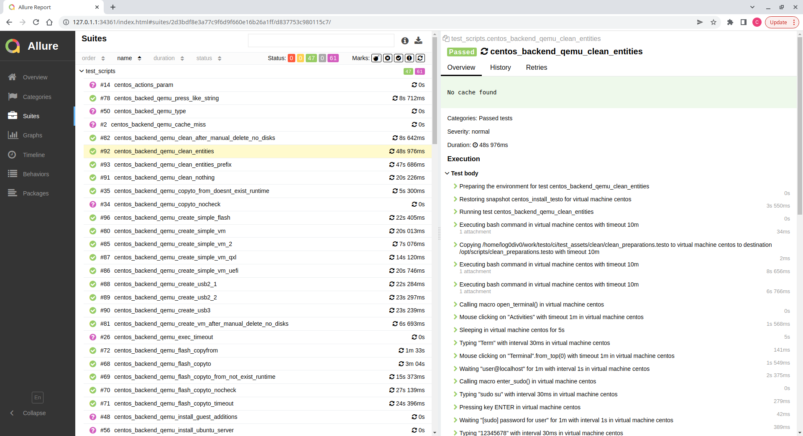

# Testo

Testo is an end-to-end-tests automation framework.

- [Motivation](#motivation)
- [What is Testo?](#what-is-testo)
- [Framework overview](#framework-overview)
  - [Language for test scenarios](#language-for-test-scenarios)
  - [Interpreter](#interpreter)
  - [Neural networks server](#neural-networks-server)
  - [Guest additions](#guest-additions)
  - [Reporting tools](#reporting-tools)
  - [Neural networks and dataset generators](#neural-networks-and-dataset-generators)
  - [Syntax highlighting](#syntax-highlighting)
- [Features](#features)
- [Roadmap](#roadmap)
- [Downloads](#downloads)
- [Installation](#installation)
  - [Debian/Ubuntu](#debianubuntu)
  - [CentOS](#centos)
  - [Windows](#windows)
- [Documentation](#documentation)
- [Building from source](#building-from-source)
- [Running tests](#running-tests)
- [Credits](#credits)
- [License](#license)

## Motivation

If you’ve tried to develop a more or less complex software product, you should’ve encountered the situations when, for some reason, it is impossible to automate the End-to-End (E2E) tests for your software. These reasons are many, let’s name a couple of them:

- The software doesn’t have (or just can’t have, for security reasons) an API you can hook up with.
- The software is legacy and was developed back in times when no one bothered with the tests’ automation.
- The software’s testing involves some third-party software (antivirus, for instance).
- The software must be tested under numerous target operating systems.
- The software requires multiple virtual machines at the same time for testing.

All these and many other obstacles lead to the worst nightmare of any developer — manual testing. But the worst part of it is that you can’t just test the software one time and leave it be. No, before each release (maybe even more often) you have to deploy your virtual machines, upload another software build, and do the same testing routine again and again, checking for possible regressions.

This is exactly the problem that Testo is trying to solve.

## What is Testo?

You see, a lot of E2E testing actually happens inside virtual machines. And any test executed on a virtual machine can be represented as a sequence of simple actions, for example:

1) Click the “Save” text on the screen.
2) Type the “Hello world” text on the keyboard.
3) Wait for the “Complete” text to appear on the screen.

And it doesn’t matter whether you’re testing a XAML-app, Qt-app, Electron-app, a web page or even a console application. You just click on the virtual machine’s screen and you don’t really care about the app’s internal design.

As you can guess, this test scenario can be automated. Hypervisor API can be used to create virtual machines and to control keyboard/mouse input. Artificial neural networks can be used to detect whether some text (or UI element) is present on the screen of the virtual machine and if so, where exactly it is located. If we combine a hypervisor API and nueral networks together, and add a simple language for writing down test scenarios we get Testo framework.

For example, the test scenario described above can be written as follows:

```
mouse click "Save"
type "Hello world"
wait "Complete"
```

## Framework overview

### Language for test scenarios

We deleoped a simple language to quickly and simply write down your E2E test scenarios. We call it Testo-lang. We're not going to dive into details here because there is an extensive documentation for that, but we'll say a few words about Testo-lang so that you have an idea of what it looks like.

As it was said, a test scenario is essentially a sequence of simple actions with a virtual machine. You don't need to create virtual machines manually. Instead you declare them as part of a test scenario:

```
machine my_super_vm {
    ram: 2Gb
    cpus: 2
    iso: "ubuntu_server.iso"
    disk main: {
        size: 5Gb
    }
}
```

This snippet instructs Testo-lang interpreter to create a virtual machine with 2Gb RAM, 2 CPU cores and 5Gb of disk space. The ISO “ubuntu_server.iso” is inserted in the virtual DVD-drive of the virtual machine, so when the machine is powered on, the Ubuntu Server installation menu pops up.

As soon as you have at least one virtual machine you can start writing the actual tests:

```
test my_super_test {
    my_super_vm {
        start
        wait "Language"
        press Enter
        wait "Install Ubuntu Server"
        press Enter
        # And so on
        ...
    }
}
```

This snippet declares a single test called `my_super_test` which uses only one virtual machine - `my_super_vm`. When running this test, the virual machine will be turned on first (`start` action). After that Testo-lang interpreter will wait for the "Language" text to appear on the screen of the virtual machine. If the text does not appear in a reasonable time - the test will fail. Then Testo-lang interpreter will press "Enter" key on virtual machine's keyboard. And so on.

This may seem counter-intuitive at first, because we consider the OS installation as just yet another test, on a line with any other regular software-checking tests. But it gets more reasonable if you imagine that you might develop the actual OS itself! Maybe you’re developing some custom OS (another Linux-based distribution, for example), or it’s just a simple just-for-fun toy OS. In any case, we do not make any distinction between testing OS and an application running inside of OS. The whole virtual machine is a system under test (SUT). That greatly simplifies testing application that actively interacting with OS or consist of several executable files.

Looking ahead, I'll say that you don't have to install OS as a part of a test scenario. You can use a pre-installed VM image.

### Interpreter

Once you have a test scenario you can run it with Testo-lang interpreter:

```
testo run my_super_file.testo
```

The interpreter will create and manage virtual machines, virtual networks and virtual flash drives for you. At the moment it works with QEMU on Linux and Hyper-V on Windows (Hyper-V support is experimental). Despite the support of totally different hypervisors we try to keep Testo-lang hypervisor-independent, i.e. the same test scenario should run the same way on different OS and hypervisors.

Testo-lang interpreter has the same capabilities as most of existing (unit) testing frameworks:

- selecting the tests that you want to run
- defining parameters for the tests
- choosing the report format and the path where to save the report

All this can be done via command line agruments of `testo`, for example:

```
testo run my_super_file.testo --test_spec test_* --param NAME value --report_format=allure --report_folder=/some/path
```

It worth mentioning here that Testo-lang is heavily inspired by another language called CMake. Indeed, running tests with Testo-lang interpreter is very much like building a program from source code. If you have ever compiled a program using CMake or simular build system, then you know that the program is rebuilt only if its  code was changed since the last build. Similar mechanism of "incremental test running" takes place in Testo-lang as well: **a test runs only if its scenario or its dependencies have been changed**. That's one of the main reasons why we decided to make our own language.

You can read more about caching system and test hierarchy in the documentation.

### Neural networks server

Neural networks are used in Testo to determine whether some object is depicted on the screen of VM and if so, where exactly it's placed. For example the action

```
wait "Hello world"
```

make the interpreter to use neural network to determine whether "Hello world" text is on the screen. And the action

```
mouse click img "path/to/icon.png"
```

ask neural network where exactly the icon is depicted so the interpreter can place a mouse upon the specified icon.

Initially neural networks were a part of the Testo-lang interpreter. But then we decided to split apart the interpreter and neural networks so that they could be run on separate computers. You see, neural networks can be accelerated significantly with the help of a modern GPU. On the other hand, hypervisors usually run on powerful servers that don't have any GPU. Now it's a common practice to have a dedicated computer running Testo neural network server and multiple computers with a hypervisor running Testo interpreter that makes requests to the server. But still nothing prevents you from running them both on the same computer.

### Guest additions

If you've ever used VirtualBox or VMware hypervisors you're probably familiar with VirtualBox guest additions and WMware tools. They provide convenient integration of the host and guest OS. Usually they allow to automatically change the screen resolution of the guest and, for example, to copy files from the host to the guest or vice versa.

Testo framework provides similar Testo guest additions. They are used for two tasks:

- to run arbitrary `bash` or `cmd` commands on the guest OS:

```
exec bash "echo Hello $USER"
```

- and to copy files between the guest and the host:

```
copyto "/host/file.txt" "/guest/file.txt"
copyfrom "/guest/file.txt" "/host/file.txt"
```

Testo guest additions are available for any combination of QEMU/Hyper-V hypervisors and Linux/Windows guest OS.

### Reporting tools

When running tests using `testo` interpreter, you can add a `--report_format` command line parameter to specify the desired report format. It can have the following options:

1) `allure`. After the test run is completed, the interpreter will create a folder in a format that can be viewed by [Allure framework](https://docs.qameta.io/allure-report/).
2) `native_remote`. In this case the interpreter will connect to your (custom) server and will transmit to it information about the progress of the tests in real time. See [testo-jira-plugin](https://github.com/testo-lang/testo-jira-plugin) as an example of using such report format.
3) `native_local` - After the test run is completed, the interpreter will create a folder that contains a set of json files that can be used later to upload test result somewhere else.

We recommend to use `allure` report format as the most simple and convenient way to view the test results. Here is a screenshot of what the test results look like in [Allure framework](https://docs.qameta.io/allure-report/):



### Neural networks and dataset generators

Detection and recognition of text/icons/GUI on VM screenshots is rather different from detection objects on photos of the real world. On the one hand objects on screenshots usually are very small, maybe just a few pixels. Sometimes it's difficult to recognize some UI element even for a human. On the other hand screenshots themselves may be very large which greatly increases the execution time of the neural network. There are other domain-specific factors that need to be taken into account, for example anti-aliasing while [font rasterization](https://en.wikipedia.org/wiki/Font_rasterization).

This leads us to the need to train our own neural networks. Testo framework includes a set of tools, that help to do it.

- [Dataset editor](nn/dataset/editor) for manual dataset labeling based on [Electron](https://www.electronjs.org/)
- [Utils](nn/renderer) for dataset augmentation written in C++
- [Scripts](nn/trainer) for neural network training based on [Pytorch](https://pytorch.org/)
- [Neural network server](src/testo_nn_server) for neural network inferencing based on [ONNX Runtime](https://onnxruntime.ai/)

### Syntax highlighting

Plugins are available for [VS Code](https://github.com/testo-lang/testo-vscode) and [Sublime Text](https://github.com/testo-lang/testo-sublime).

## Features

- Creating VMs from scratch or importing existing VM images
- Ability to use multiples VMs in the same test
- Cache system based on VM snapshots
- Automatic test dependency management
- Virtual flash drives (only QEMU at the moment) and virtual networks support
- Macros & params 
- Detecting text and images on VM screen with simple sintax
- Javascript support for more complicated queries
- Keyboard and mouse support
- Automatic keyboard layout switching when typing muti-language text
- Shared forlders support (only QEMU at the moment)
- QEMU & Hyper-V support (Hyper-V support is experimental)
- Linux & Windows as guest and host OS support 
- Copying files between host and guest OS
- Running arbitrary `bash` or `cmd` commands on guest OS
- Different report formats
- ARM64 support (only interpreter and only for Linux)
- REPL mode 

## Roadmap

- [ ] Support for seaching for icons on VM screen using a template image (At the moment Neural network server contains a stub that compare VM screenshot and template image pixel by pixel. This requires a template image to be exactly the same size and color as the icon on the screen)
- [ ] Neural networks for searching UI elements like buttons, scroll bars, tabs, etc.
- [ ] Support for more complex visual-queries to make it possible, for example to pick a certain cell in a table.
- [ ] Support for running tests on a clusters of computers

## Downloads

See [releases](https://github.com/log0div0/testo/releases) page for downloads and release notes.

## Installation

Make sure that you have Intel VT feature (if you have an Intel CPU) or AMD-V feature (if you have an AMD CPU) enabled in BIOS. Testo won't run without the CPU virtualization feature enabled.

Note that Testo interpreter and Testo NN server can be installed on separate computers. It's recommended to install Testo NN server on a computer with Nvidia GPU.

### Debian/Ubuntu

```
sudo apt install libvirt0 libvirt-clients libvirt-daemon-system libguestfs0 qemu qemu-kvm ebtables dnsmasq-base
sudo dpkg -i testo-nn-server.deb testo.deb
testo version
```

It is also recommended (though not necessary) to install the package `virt-manager` - a GUI client for QEMU/KVM hypervisor. With virt-manager you can much easier observe the test runs, as well as control virtual machines manually when necessary. You can install the `virt-manager` with the command:

```
sudo apt install virt-manager
```

### CentOS

```
sudo yum -y install qemu-kvm libvirt libguestfs iptables-ebtables dnsmasq
sudo rpm -i testo-nn-server.rpm testo.rpm
testo version
```

It is also recommended (though not necessary) to install the package `virt-manager` - a GUI client for QEMU/KVM hypervisor. With virt-manager you can much easier observe the test runs, as well as control virtual machines manually when necessary. You can install the `virt-manager` with the command:

```
sudo yum -y install virt-manager
```

### Windows

Pay attention that Testo framework for Hyper-V works in experimental mode. Some actions and features are not available.

1. [Install](https://docs.microsoft.com/en-us/virtualization/hyper-v-on-windows/quick-start/enable-hyper-v) the Hyper-V hypervisor.
2. Download and launch the Testo framework installation files. Then follow the instructions.
3. Open the command shell (cmd) and run the command

``` bash
testo version
```

## Documentation

- [Tutorials](docs/tutorials) folder is the best place for a start.
- [Reference](docs/reference) can be used if you want to see the details.
- [Examples](https://github.com/testo-lang/testo-examples) repo contains a couple of basic use-cases of Testo framework. This repo also contains source code of apps that are being tested.

## Building from source

Probably the most simple way to build Testo is to let Testo to build itself. We have written tests that set up the buld environment on all supported operating systems and build Testo packages from source code. This tests can be found in the [`ci`](ci) folder and run with the following command:

```
cd ci
sudo ./build_testo.sh
```

In any case, I'll dublicate the instructions for building the project here.

1. Download or build from sources [ONNX Runtime](https://onnxruntime.ai/).
2. Install dev packages:

Ubuntu/Debian:

```
apt -y install git gcc g++ make libssl-dev python3-dev libvirt-dev libguestfs-dev rpm cmake
```

CentOS:

```
yum -y install git gcc gcc-c++ make openssl-devel python3-devel libvirt-devel rpm-build libguestfs-devel cmake
```

Windows: Visual Studio, Git, CMake, Python, Wix

3. Build Testo packages

```
mkdir testo_build
cd testo_build
cmake ../testo \
  -DCMAKE_BUILD_TYPE=Release \
  -DCPACK_GENERATOR=DEB \
  -DONNX_RUNTIME_DIR=/path/to/onnxruntime_dist \
  -DUSE_CUDA=on
make testo-package testo-nn-server-package -j$(nproc)
```

## Running tests

Testo framework has two levels of tests. Most basic and simple tests are placed in [`tests`](tests) directory. This tests are based on [pytest](https://docs.pytest.org/) framework and can be run with the following command:

```
cd tests
sudo pytest
```

More complex tests that involve interaction with OS or `virt-manager` are written on Testo-lang, i.e. Testo Framework is used to test itself. This leads to nested virtualization, so this tests are much slower and require much more memory. They can be found in [`ci`](ci) and run with the following command:

```
cd ci
sudo ./test.sh
```

## Credits

Next libraries are used in Testo framework:

- [Asio](https://think-async.com/Asio/) - a cross-platform C++ library for network and low-level I/O programming. Boost Software License.
- [Coro](https://github.com/log0div0/coro) - a coroutine library that works on top of Asio. MIT License.
- [fmt](https://fmt.dev/) - a modern formatting library. MIT license.
- [ghc](https://github.com/gulrak/filesystem) - an implementation of C++17 std::filesystem for C++11 /C++14/C++17/C++20 on Windows, macOS, Linux and FreeBSD. MIT license.
- [json](https://github.com/nlohmann/json) - JSON for Modern C++. MIT License.
- [pugixml](https://pugixml.org/) - a light-weight C++ XML processing library. MIT License.
- [QuickJS](https://bellard.org/quickjs/) - a small and embeddable Javascript engine. MIT license.
- [spdlog](https://github.com/gabime/spdlog) - a fast C++ logging library. MIT License.
- [base64](https://stackoverflow.com/questions/180947/base64-decode-snippet-in-c) - two functions borrowed from StackOverflow. Originally written by René Nyffenegger, zlib/libpng license as I can guess.
- [Catch2](https://github.com/catchorg/Catch2) - a modern, C++-native, test framework for unit-tests, TDD and BDD. Boost Software License.
- [CLIPP](https://github.com/muellan/clipp) - command line interfaces for modern C++. MIT License.
- [rang](https://github.com/agauniyal/rang) - a Minimal, Header only Modern c++ library for terminal goodies. The Unlicense.
- [ScopeGuard](https://github.com/Neargye/scope_guard) - Scope Guard & Defer C++. MIT License.
- [stb](https://github.com/nothings/stb) - single-file public domain (or MIT licensed) libraries for C/C++.
- [wildcards](https://github.com/zemasoft/wildcards) - a simple C++ header-only template library implementing matching using wildcards. Boost Software License.

## License

MIT License
test commit
