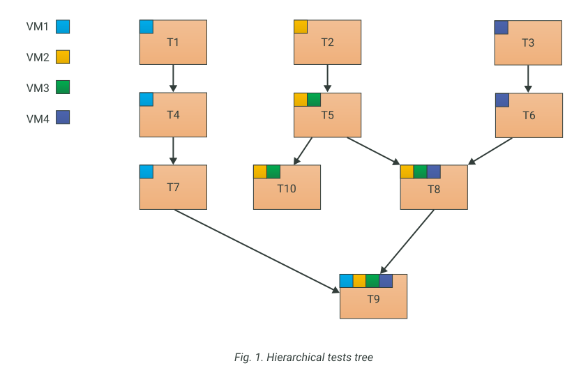
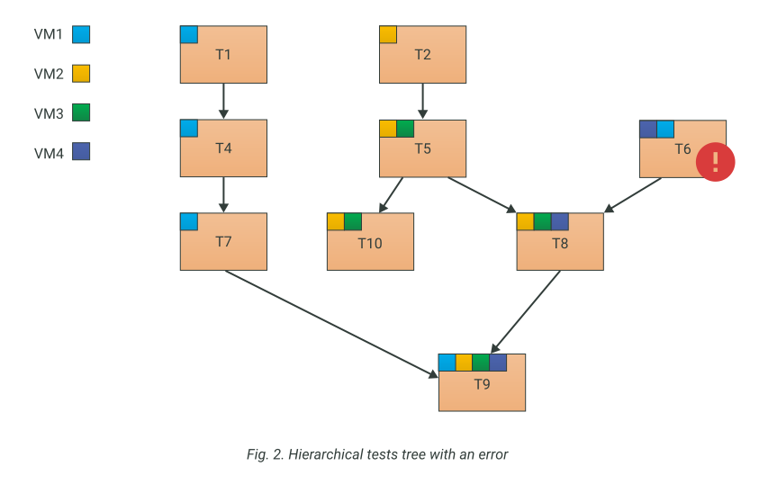

# Cache system and test hierarchy

## Organizing the tests

In Testo Framework tests are hierarchical and base on the "testing from the simple to the complex" concept. The more complex test relies on the successful run of the simplier test and runs only when the simple test is complete.

In the figure above the tests `T1`, `T2` and `T3` are the most basic and simple, they are to be run in any case. The `T4` test is run only if (and when) the test `T1` completes with a success (tests  `T5`, `T6`, `T7` and `Т10` have the similar situation). The test `T8` requires the success of the tests `T5` and `T6`. Test `T9` is the most complex and requires all the other tests to be completed successfully.

> You can specify the tests to be run with the `test_spec <wildcard match>` command line argument. In this case Testo will run only the tests which names match the template `<wildcard match>`. You could also exclude certain tests from running with the `exclude <wildcard match>` argument.

## Restrictions in the tests organization

### Virtual Machines referencing restrictions

All tests have one or more virtual machines (VM). A child-test may use either the exact set of VMs from its parent tests (tests `T1`, `T4`, `T7` on the fig. 1) or the exact set of VMs plus one or more new virtual machines that were not used before (test `T2`, `T5`).

The moment a VM is referenced in a test, it becomes bound to this test. From now on, this VM is bound to all the children-tests of this test, even if there's no new references of this virtual machine, ever. For example, the virtual machine `VM3` is first referenced in the  test `T5`. Now `VM3` is bound to the test `T5`. `T5` also has the childen `T8` and `T9`, so they inherit the `VM3` binding, even if they have no commands involving `VM3`.

In Testo Framework the situation when a virtual machine is bound to more than one parent-test **is prohibited**.

In the example above `VM1` was referencd in the `T6` test. This situation is treated as an error: both parents for the test `T9` have the same virtual machine `VM1` bound to them.

### Virtual Flash Drives referencing restrictions

Virtual flash drives share the policy of referencing restrictions with virtual machines. When a flash drive is plugged or referenced during a test, this flash drive becomes bound to the test and all its children. Similar to the virtual machines restriction, the situation when a flash drive is bound to more than one parent-test is prohibited.

## Snapshots and tests caching technology

Tests running could take quite a lot of time. So, to save the users' time, Testo Framework implements the tests caching technology. This technology prevents tests from re-running unless there is a sufficient [reason](Tests.md#validating-the-test-cache) to do it.

The tests running process is similar to software's incrimental compilation: to build a programm you need to recompile only the outdated or not-precompiled sources.

By default, at the end of each successfully run test, for every test-bound virtual machine a snapshot is created. This snapshot is used in the future for "incrimental" tests runs.

Let's consider the following example. Take a look at the fig. 1. Let's assume that we need to run all the tests and we're doing this for the first time. In this case Testo will perform "the full run", from the top to the bottom, according to the hierarchy. If there are no errors, then at the end of each successful test, snapshots for every bound VM and virtual flash drive are created. The tests themselves is marked "cached". If the tests are run one more time after that, the run will complete instantly, because all the tests are cached now (there was no significant changes since the last successful run).

For example, if the test `T4` loses the cache for any [reason](Tests.md#validating-the-test-cache), then all the `T4`'s children (`T7` and `T9`) lose their cache as well. In this case the second run will cause Testo to restore the snapshots for the VMs `VM1`, `VM2`, `VM3` and `VM4` and rollback them to the state they were at the end of the tests `T1` and `T8`. All the un-cached tests will be run: `T4`, `T7`, `T8` and `T9`.

> You can invalidate the tests cache manually by using the `--invalidate <wildcard match>` command line argument. All the children-tests will lose their cache automatically.

> Likewise, Testo creates snapshots for virtual flash drives referenced in a test. This way you can always be sure that all the flash drives are in the exact state you expect them to be. Any changes to the flash drives in other tests will be canceled.

> Before actually running the tests, the interpreter asks interactively the user for the confirmation to run the tests which lost their cache. It is done because test runs could take a really long time, so we want to give the user a chance to reconsider the run if the cache loss is caused by some kind of miskate. You can disable this warning with the `--assume_yes` command line argument.

## Tests without hypervisor snapshots

With the tests amount piling up, the situation becomes more and more demanding for the disk space being consumed. To save as much disk space as possible, you can create tests without hypervisor snapshots. To do so you must specify the `[no_snapshots: true]` attribute just before the test declaration. In this case no hypervisor snapshots are going to be created at the end of the test for the virtual machines bound to the test. This can save you a lot of disk space.

> The absence of the hypervisor snapshots **does not** mean the absence of caching - those are completely different and independent mechanisms in Testo Framework. And hence, a test marked with the `no_snaphots: true` attribute is still cached all the same and still not going to run second time (without a [reason](Tests.md#validating-the-test-cache) to do so).

Tests without the hypervisor snapshots let you save disk space, but there's a downside to this mechanism as well: no-snapshots tests cannot be used as a "starting point" in inrecemntal tests running. For example, if the test `T4` (fig. 1) is marked `no_snapshots: true`, and the test `T7` loses its cache for some reason, then instead of rolling back `VM1` to the end of `T4` state, Testo will be forced to rollback `VM1` to the `T1` state (if `T1` is not marked as `no_snapshots`) and re-run the test `T4`, even though it has a valid cache. This behaviour is required to get the VMs in the right state before running the lost-cache test.

> `no_snapshots` mechanism lets you generally adjust the "tests run speed - disk space saving" ratio. Some tests may be marked as `no_snapshots` without any drawbacks, and other tests shouldn't be marked as such because it would be too costly. You should stick to the general rule: tests writer should choose the "anchor" tests. The "anchor" test means that its results will be often restored when doing incremental testing (their cache looks solid and won't be lost too often). These tests are strictly advised to have the hypervisor snapshots. More volatile tests (cache is lost often enough) may be marked as `no_snapshots: true`.

> You can see `no_snapshots` attribute management in action in the [tutorial](../tutorials/11%20-%20no_snapshots).

Since Testo 3.5.0 `no_snapshots` attribute was replaced with more general `snapshots` attribute. The new attribute has 3 possible values:

1) `never` - Never create hypervisor snapshots of VM for the test (the same as `no_snapshots: true`)
2) `always` - Always create hypervisor snapshots of VM for the test (the same as `no_snapshots: false`)
3) `auto` - A new option which tries to maintain a balance between disk space usage and tests execution time. After the end of running all the tests this option behaves exactly the same as `never` option. The difference occurs while tests execution. This option allowes the interpreter to create temporary hypervisor snapshots if it will save time for you. This temporary snapshots will be deleted as soon as they are no longer needed.

> `no_snapshots` attribute is still supported for backward compability reasons.
