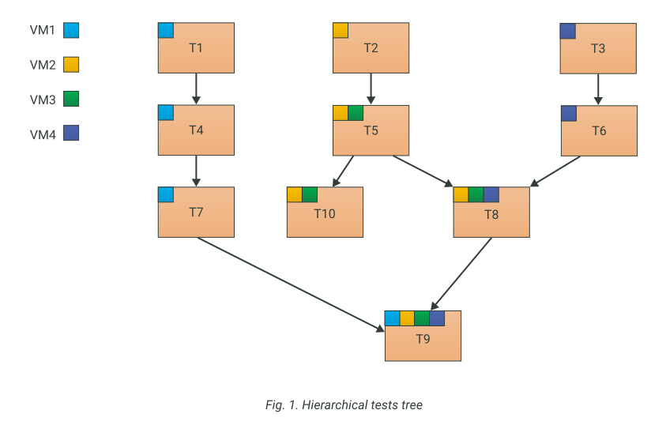

# Tests declaration

Tests are declared starting with the `test` keyword. The declaration has the following syntax:

```text
[[
	<attr1>: <value1>
	<attr2>: <value1>
	<attr3>: <value1>
]]
test <test_name>[: test_parent1, test_parent2, ...]
{
	command1
	command2
	...
}
```

> Tests can also be defined inside macros. See [here](Macros.md#macros-with-declarations) for more information.

A test declaration has an optional header with a set of attributes (enclosed in brackets `[]`) followed by a newline, a keyword `test`, a tests-unique name `test_name`, an optional parental tests list and a test body. The test body is a list of commands.

Test name can be either an identifier or a string. If a string is used, the value inside the string must be convertible to a identifier. Inside the string [param referencing](Params.md#param-referencing) is available.

Test attributes has the same syntax as virtual machines', flash drives' and networks' attributes. The syntax is described [here](Machines.md).

All the attributes are **optional**. There are the list of available attributes:
- `no_snapshots` - Type: boolean. Deprecated. If `true`, no hypervisor snapshots will be created for the virtual entities (virtual machines and flash drives) participating in the test. For more information see [below](#tests-without-hypervisor-snapshots). Default value is `false`.
- `snapshots` - Type: string. The replacement for `no_snapshots`. Possible options: `never`, `always` and `auto`. For more information see [below](#tests-without-hypervisor-snapshots).
- `depends_on` - Type: list of test identifiers separated by a comma. This attribute makes sure that the current test will not be started until all the tests in the list are successfully finished (even if the listed tests are not ancestor of the current test).
- `title` - Type: string. An alternative human-readable name of the test which is used in [Allure](https://docs.qameta.io/allure) reports.
- `description` - Type: string. Test description. Will be added to the final report, which is generated if the `--report_format` and `--report_folder` command line arguments are specified.
- `feature` - Type: string. A BDD marker which is used by [Allure](https://docs.qameta.io/allure). The value can be arbitrary.
- `story` - Type: string. A BDD marker which is used by [Allure](https://docs.qameta.io/allure). The value can be arbitrary.
- `severity` - Type: string. A serverity label which is used by [Allure](https://docs.qameta.io/allure). Possible values: `blocker`, `critical`, `normal`, `minor`, `trivial`.

If the test depends on the successful results of some other tests, you should specify those tests in parental tests list (preffered method) or in `depends_on` attribute list. For example, a test with network configuration probably depends on a test with an operating system installation.

## Commands syntax

A test basically is a list of commands. A command has the following syntax:

```text
<vm_name | flash_drive_name> <action>
```

A command consists of two parts: a virtual entity's (machine or flash drive) name and a body (which could be an action, an [if-statement](Conditions.md) or a [for-statement](Loops.md)) to be applied to the entity. A block of actions is also considered an action, in which case the command looks like this:

```text
<vm_name | flash_drive_name> {
	action1
	action2
	action3; action4; action5
	action6;
	{
		action7; action8
	}
}
```

> For Hyper-V you can use *only* commands with virtual machines. Commands with virtual flash drives are not available at the moment.

Actions must be separated with a newline or a semicolon (`;`). The list of possible actions can be found [here](Actions.md).

A [macro with commands](Macros.md#macros-with-commands) call is also considered as a command.

## Virtual entity's name parameterization

In commands, the entity name can be represented two ways: as an indentifier (`client`, `my_flash`) and as a string (`"client"`, `"my_flash"`). Both ways are equal.

But at the same time the string representation could be useful in some cases, because you can use [param referencing](Params.md#param-referencing) inside the strings. This is especially useful if you want to pass the virtual entities' names inside macros.

> You should keep in mind, that some actions that are available for virtual machine, aren't available for flash drives. And therefore, there is a possibility that after the param resolving the command can turn up syntactically invalid (see example below).

**Examples**

```testo
# OK, if "client" is a virtual machine
client type "hello world"

# The same as above
"client" type "Hello world"

# Correct in any case
# since the "print" action is applicable both to VMs and flash drives
my_flash_drive print "Hello world"

# Same as above
"my_flash_drive" print "Hello world"

# Correct only if the "entity_name" value
# corresponds to one of the virtual machines' names
"${entity_name}" type "Hello world"
```

## Test running concepts

A test run is a four-step process:

- Validating the test cache.
- Preparing the running environment.
- Applying commands.
- Staging the running environment.

### Validating the test cache

Caching is an important technology in the Testo Framework. The main goal of this mechanism is to save your time by not running the tests that are up-to-date.

The first time a test is run successfully, a cache is created for this test.

When trying to run a cached test, its cache's consistency is evaluated. If nothing sufficient has changed in the test's script, the cache is considered valid and the test is not actually run. Othwervise the cache is lost, the test and all its children (recursively) are queued to run. Below you can see a complete list of all checks to be performed when evaluating the cache's validity.

- Do any of the test's parents have an invalid cache?
- Have the commands changed?
- Has the test's header changed?
- Have the values for the params referenced in the tests changed?
- Do all the referenced virtual machines have the [valid](Machines.md#virtual-machines-caching) cache of theirs configurations?
- Do all the referenced virtual flash drives have the [valid](Flash%20drives.md#virtual-flash-drives-caching) cache of theirs configurations?
- Have the checksums for the files and folders being copied to with the `copyto` actions changed?
- Have the checksums for the iso-files being plugged with the `plug dvd` actions changed?

If there is at least one "yes" answer to these questions, the cache is considered lost and the test is queued for the run. All the children are queued as well.

> You could always invalidate the cache manually with the `--invalidate <wildcard match>` command line argument. All the children will lose the cache as well.

> There are two ways to check the files' cache consistency for the `copyto` and the `plug dvd` actions. If the file's size is less then 1 MB, then the file's integrity is evaluated based on its contents. Othwervise the evaluation is based on the Last modified timestamp of the file. You can adust the threshold of the evaluating mode changes with the `content_cksum_maxsize` command line argument.

If the cache is valid, then the test is not actually run and the Testo interpreter goes to the next test.

### Preparing the running environment

If the test is queued for a running, then all the virtual machines and virtual flash drives have to be restored into the states they need to be for the test to run:

- All the virtual machines, that were not previously mentioned in any parental test (if there is any) are created. After creation they will stay powered off, so you need to call the `start` action to activate them.
- If the parental tests don't have a `no_snapshots: true` attribute, then Testo restores all the required snapshots for the virtual machines and the flash drives and reverts them to the states they were at the end of the parental tests.
- If the parental tests have a `no_snapshots: true` attribute, then the virtual resources (VMs and flash drives) from them don't have the hypervisor snapshots, and their state can't be restored. In this case Testo searches the tests hierarchy up for a "anchor" test (a test with hypervisor snapshots) and restores the states for the virtual machines and the virtual flash drives they were at the end of the "anchor" test. After that, all the intermediate parental tests are run, so the virtual machines and flash drives are reverted to the apropriate state.

### Applying commands

Applying commands is a process of consequitive interpreting the actions to the virtual machines and flash drives mentioned at the beginning of a command.

If any action fails, the whole test is considered failed, and Testo moves on to the next test (only when no `--stop_on_fail` command line attribute is specified). If the failed test has any children, they are also considered failed by default.

### Staging the running environment

After a successful test run, Testo stages the bound virtual machines and flash rives in the state they are at the end of the test. If the test doesn't have a `no_snapshots: true` attribute, then hypervisor snapshots for all the virtual machines and flash drives are created. The test's cache is updated.

## Organizing the tests

In Testo Framework tests are hierarchical and base on the "testing from the simple to the complex" concept. The more complex test relies on the successful run of the simplier test and runs only when the simple test is complete.



In the figure above the tests `T1`, `T2` and `T3` are the most basic and simple, they are to be run in any case. The `T4` test is run only if (and when) the test `T1` completes with a success (tests  `T5`, `T6`, `T7` and `Т10` have the similar situation). The test `T8` requires the success of the tests `T5` and `T6`. Test `T9` is the most complex and requires all the other tests to be completed successfully.

> You can specify the tests to be run with the `test_spec <wildcard match>` command line argument. In this case Testo will run only the tests which names match the template `<wildcard match>`. You could also exclude certain tests from running with the `exclude <wildcard match>` argument.

## Restrictions in the tests organization

### Virtual Machines referencing restrictions

All tests have one or more virtual machines (VM). A child-test may use either the exact set of VMs from its parent tests (tests `T1`, `T4`, `T7` on the fig. 1) or the exact set of VMs plus one or more new virtual machines that were not used before (test `T2`, `T5`).

The moment a VM is referenced in a test, it becomes bound to this test. From now on, this VM is bound to all the children-tests of this test, even if there's no new references of this virtual machine, ever. For example, the virtual machine `VM3` is first referenced in the  test `T5`. Now `VM3` is bound to the test `T5`. `T5` also has the childen `T8` and `T9`, so they inherit the `VM3` binding, even if they have no commands involving `VM3`.

In Testo Framework the situation when a virtual machine is bound to more than one parent-test **is prohibited**.


In the example above `VM1` was referencd in the `T6` test. This situation is treated as an error: both parents for the test `T9` have the same virtual machine `VM1` bound to them.

### Virtual Flash Drives referencing restrictions

Virtual flash drives share the policy of referencing restrictions with virtual machines. When a flash drive is plugged or referenced during a test, this flash drive becomes bound to the test and all its children. Similar to the virtual machines restriction, the situation when a flash drive is bound to more than one parent-test is prohibited.

## Snapshots and tests caching technology

Tests running could take quite a lot of time. So, to save the users' time, Testo Framework implements the tests caching technology. This technology prevents tests from re-running unless there is a sufficient [reason](#validating-the-test-cache) to do it.

The tests running process is similar to software's incrimental compilation: to build a programm you need to recompile only the outdated or not-precompiled sources.

By default, at the end of each successfully run test, for every test-bound virtual machine a snapshot is created. This snapshot is used in the future for "incrimental" tests runs.

Let's consider the following example. Take a look at the fig. 1. Let's assume that we need to run all the tests and we're doing this for the first time. In this case Testo will perform "the full run", from the top to the bottom, according to the hierarchy. If there are no errors, then at the end of each successful test, snapshots for every bound VM and virtual flash drive are created. The tests themselves is marked "cached". If the tests are run one more time after that, the run will complete instantly, because all the tests are cached now (there was no significant changes since the last successful run).

For example, if the test `T4` loses the cache for any [reason](#validating-the-test-cache), then all the `T4`'s children (`T7` and `T9`) lose their cache as well. In this case the second run will cause Testo to restore the snapshots for the VMs `VM1`, `VM2`, `VM3` and `VM4` and rollback them to the state they were at the end of the tests `T1` and `T8`. All the un-cached tests will be run: `T4`, `T7`, `T8` and `T9`.

> You can invalidate the tests cache manually by using the `--invalidate <wildcard match>` command line argument. All the children-tests will lose their cache automatically.

> Likewise, Testo creates snapshots for virtual flash drives referenced in a test. This way you can always be sure that all the flash drives are in the exact state you expect them to be. Any changes to the flash drives in other tests will be canceled.

> Before actually running the tests, the interpreter asks interactively the user for the confirmation to run the tests which lost their cache. It is done because test runs could take a really long time, so we want to give the user a chance to reconsider the run if the cache loss is caused by some kind of miskate. You can disable this warning with the `--assume_yes` command line argument.

## Tests without hypervisor snapshots

With the tests amount piling up, the situation becomes more and more demanding for the disk space being consumed. To save as much disk space as possible, you can create tests without hypervisor snapshots. To do so you must specify the `[no_snapshots: true]` attribute just before the test declaration. In this case no hypervisor snapshots are going to be created at the end of the test for the virtual machines bound to the test. This can save you a lot of disk space.

> The absence of the hypervisor snapshots **does not** mean the absence of caching - those are completely different and independent mechanisms in Testo Framework. And hence, a test marked with the `no_snaphots: true` attribute is still cached all the same and still not going to run second time (without a [reason](#validating-the-test-cache) to do so).

Tests without the hypervisor snapshots let you save disk space, but there's a downside to this mechanism as well: no-snapshots tests cannot be used as a "starting point" in inrecemntal tests running. For example, if the test `T4` (fig. 1) is marked `no_snapshots: true`, and the test `T7` loses its cache for some reason, then instead of rolling back `VM1` to the end of `T4` state, Testo will be forced to rollback `VM1` to the `T1` state (if `T1` is not marked as `no_snapshots`) and re-run the test `T4`, even though it has a valid cache. This behaviour is required to get the VMs in the right state before running the lost-cache test.

> `no_snapshots` mechanism lets you generally adjust the "tests run speed - disk space saving" ratio. Some tests may be marked as `no_snapshots` without any drawbacks, and other tests shouldn't be marked as such because it would be too costly. You should stick to the general rule: tests writer should choose the "anchor" tests. The "anchor" test means that its results will be often restored when doing incremental testing (their cache looks solid and won't be lost too often). These tests are strictly advised to have the hypervisor snapshots. More volatile tests (cache is lost often enough) may be marked as `no_snapshots: true`.

> You can see `no_snapshots` attribute management in action in the [tutorial](../tutorials/11%20-%20no_snapshots).

Since Testo 3.5.0 `no_snapshots` attribute was replaced with more general `snapshots` attribute. The new attribute has 3 possible values:

1) `never` - Never create hypervisor snapshots of VM for the test (the same as `no_snapshots: true`)
2) `always` - Always create hypervisor snapshots of VM for the test (the same as `no_snapshots: false`)
3) `auto` - A new option which tries to maintain a balance between disk space usage and tests execution time. After the end of running all the tests this option behaves exactly the same as `never` option. The difference occurs while tests execution. This option allowes the interpreter to create temporary hypervisor snapshots if it will save time for you. This temporary snapshots will be deleted as soon as they are no longer needed.

> `no_snapshots` attribute is still supported for backward compability reasons.
