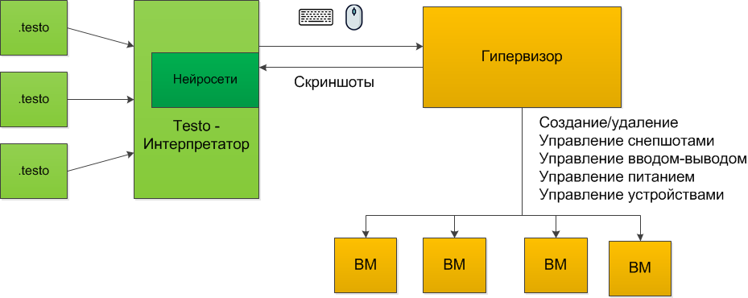
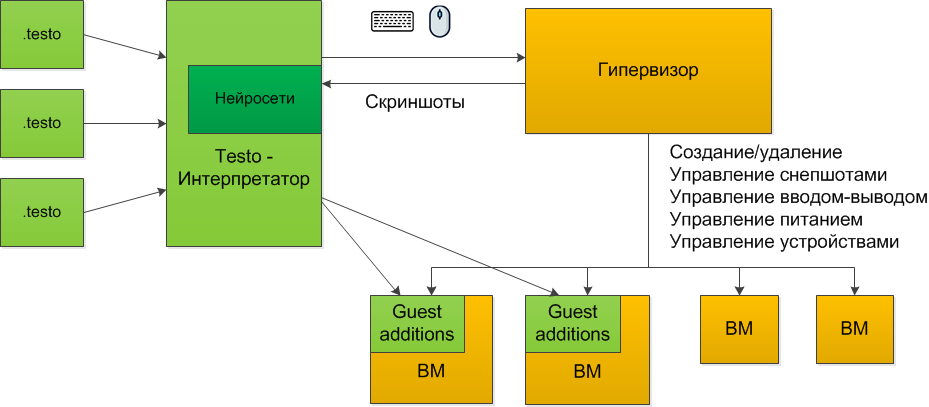

..  SPDX-License-Identifier: BSD-3-Clause
    Copyright(c) 2010-2014 Intel Corporation.

.. _QEMU: https://www.qemu.org/

Вступление
============

Данная документация содержит информацию, которая поможет вам подготовить систему к работе с тестировочной платформой Testo.

Для чего предназначен наш фреймворк
-----------------------------------
Любое программное обеспечение требует тестирования. Обычно тестирование разбивается на слои:
	- Unit-тестирование
	- Тестирование API
	- Интеграционное тестирование
	- Тестирование с точки зрения пользователя (Черный ящик)

Unit-тестирование помогает протестировать исходные коды программы, правильность выполнения тех или иных функций.

Тестирование API (если оно есть) позволяет протестировать правильность реагирования программы на те или иные команды и воздействия

Интеграционное тестирование позволяет проверить правильность работы программы **с учетом ее окружения**, то есть с учетом наличия в системе других программ, с учетом версии операционной системы, с учетом наличия сети и других узлов в ней и т.д.

Тестирование с токи зрения пользователя (или тестирование по методу черного ящика) - это тестирование программы в том виде, в котором ее увидит пользователь.

И если первые два слоя изучены достаточно подробно и их автоматизация - лишь дело техники, то интеграционное тестирование и тестирование по методу черного ящика - достаточно слабо поддаются автоматизации, в результате чего практически всю работу приходится выполнять вручную.

Тестировочный фреймворк Testo помогает решить эту проблему и позволяет организовывать автоматическое интеграционное тестирование программного обеспечения (будь то отдельная программа, комплекса программ, или целая ОС) с использованием виртуальных машин.

Основная идея, которой мы руководствовались при создании Testo - это имитация действий реальных людей, когда они осуществляют тестирование программного обеспечения. В сущности, взаимодействие человека и машины заключается в вводе (нажатии на определенные клавиши и кнопки мыши в нужном порядке, нажатии кнопок питания, подсоединению или отсоединению сетевых кабелей, флешек и дисков) и анализе вывода на экране. Если ожидаемое событие от ввода команды отличается от фактической картинки на экране (например, человек ожидает увидеть надпись "Успех", но не может её дождаться достаточно длительное время), то человек классифицирует такую ситуацию как ошибку.

Именно такое поведение мы и стремились автоматизировать в нашей тестировочной платформе.

Архитектура нашего фреймворка
-----------------------------

В основе нашей платофрмы лежит интерпретатор ``testo``, который позволяет преобразовать тесты, написанные на специально созданном скриптовом языке в последовательность команд для гипервизора (на текущий момент полноценно поддерживается только гипервизор `QEMU`_), которые затем переадресуются в виртуальные машины.

	Общая схема архитектуры фреймворка

Разработанный скриптовый язык, в отличие от языков программирования, имеет более простый синтаксис и состоит из набора интуитивно-понятных команд (нажать на клавишу, набрать текст на клавиатуре, выключить питание, вставить флешку и прочее), что позволяет составлять легко читаемые тесты, которые полностью имитируют действия конечного пользователя, что дает возможность осуществлять автоматизированное тестирование по принципу "Черного ящика".

Впрочем, иногда принцип "абсолютно" черного ящика соблюдать необязательно и достаточно трудоемко. В самом деле, набор команд командной строки зачастую гораздо проще воспринимать как "Запуск скриптов на языке Shell", чем последовательность действий типа "Нажатие клавиш". В этом случае наша платформа предоставляет возможность несколько упростить взаимодействие с виртуальной машиной с помощью установки специального агента ``negotiator`` внутрь витруальной машины.

	Общая схема архитектуры фреймворка с использованием negotiator
