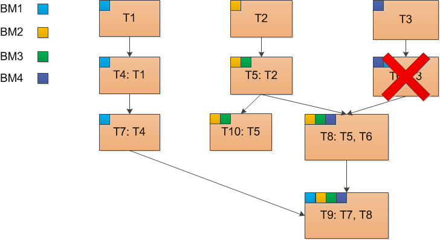

..  SPDX-License-Identifier: BSD-3-Clause
    Copyright(c) 2010-2014 Intel Corporation.

Политика запуска тестов
=======================

Организация тестов
------------------

Тесты в платформе Testo имеют иерархическую структуру и олицетворяют тестирование "от простого к сложному". Более сложный тест полагается на результат выполнения простого теста и запускается только в том случае, если простой тест прошел успешно.

.. figure:: img/tests_hierarchy.png

	рис. 1. Иерархическая структура тестов

В приведенном примере тесты ``T1``, ``T2`` и ``T3`` являются самыми простыми и будут запущены в любом случае. Тест ``T4`` запустится только если успешно отработает тест ``T1`` (тесты ``T5``, ``T6`` и ``T7`` обладают схожей логикой). Тест ``T8`` требует успешного выполнения тестов ``T5`` и ``T6``, а тест ``T9`` - успешного выполнения всех остальных тестов.

.. note::

	С помощью аргумента командной строки ``test_spec <wildcard match>`` можно ограничить множество тестов для запуска. В случае указания этого аргумента будут запущены все тесты, подходящие под шаблон поиска, указанный в ``<wildcard match>``.  Если же требуется исключить определенные тесты из плана запуска, то их можно указать с помощью аргумента ``exclude <wildcard match>``

Ограничения в организации тестов
--------------------------------

В каждом тесте (если только он не пустой) фигурирует одна или несколько Виртуальных машин (ВМ). Тест потомок по отношению к родителю может использовать либо те же виртуальные машины, которые фигурировали в предках (пример в приведенной схеме - тесты ``T1``, ``T4``, ``T7``), а может использовать новые виртуальные машины, не использованные ранее (пример - тесты ``T2``, ``T5``).

Как только к виртуальной машине в тесте было сделано хотя бы одно обращение, она начинает принадлежать тому тесту, где было выполнено обращение. После этого виртуальная машина будет принадлежать и всем потомкам этого теста, даже если к ней больше не будет происходить никаких обращений. например, в тесте ``T5`` появляется обращение к виртуальной машине ``ВМ3``, и с этого момента она принадлежит тесту ``T5``. При этом у ``T5`` есть потомки ``T8`` и ``T9``, и они унаследуют принадлежность ВМ3, даже если в них реально не будет ни одного обращения к этой виртуальной машине.

На сегодняшний момент не допускается ситуация, когда у теста одна ВМ принадлежит **более чем одному предку**.

	рис. 2. Ошибочное использование ВМ в иерархии тестов

В приведенном примере в тесте ``T6`` было выполнено обращение к ВМ1 и это является ошибочной ситуацией: для теста ``T9`` два предка будут обладать одной виртуальной машиной ВМ1.

Снепшоты и кеширование тестов
-----------------------------

Выполнение тестов может занимать значительное время, и для экономии времени в платформе Testo существует механизм кеширования тестов, что позволяет запускать только те тесты, которые требуют перезапуска по определенным причинам. Более подробное описание тех факторов, которые принимаются во внимании при кешировании тестов, смотри в **TODO**.

В целом, для простоты восприятия можно рассматривать процесс запуска тестов как процесс инкрементальной компиляции: заново будут скомпилированы только те файлы, в которых произошли какие-то изменения.

По умолчанию, в конце каждого теста для всех виртуальных машин, принадлежащих этому тесту, создается снепшот, который затем может быть использован для "инкрементального" запуска тестов.

Алгоритм работы проще всего рассмотреть на примере. Рассмотрим схему, представленную на рис.1. Допустим, что нам необходимо запустить все тесты, и при этом эти тесты запускаются в первый раз. В этом случае будет выполнен "полный прогон" всех тестов, от начала и до конца, согласно иерархии. Если не возникает никаких ошибок, то в конце всех тестов с помощью гипервизора создается снепшот, и все тесты помечаются как "кешированные". Если запустить все тесты еще раз, то программа отработает моментально, т.к. все тесты являются закешированными (с момента последнего запуска ничего значимого не произошло).

Например, если по какой-то из причин (см. **TODO**) тест ``T4`` становится незакешированным, то кеш сбрасывается и для всех его потомков: ``T7`` и ``T9``. При повторном запуске в этом случае Testo восстановит снепшоты виртуальных машин ВМ1, ВМ2, ВМ3 и ВМ4 и вернет их в то состояние, в котором они были на момент окончания тестов ``T1`` и ``T8``, и будут заново проведены все незакешированные тесты: ``T4``, ``T7``, ``T8`` и ``T9``.

.. note::

	помимо встроенных в Testo механизмов определния закеширвоанности тестов, пользователь может вручную сбросить кеш у определенных тестов, используя аргумент командной строки ``invalidate <wildcard match>``. При этом сбрасывая кэш теста, пользователь автоматически сбрасывает кеш всех его потомков

Тесты без снепшотов гипервизора
-------------------------------

При большом количестве тестов количество снешпотов может стать очень большим, что ведет к использованию очень большого дискового пространства. Поэтому для экономии места на диске в Testo предусмотрена возможность создавать тесты, которые не требуют создания снепшотов гипервизора. Для этого перед тестом необходимо указать директиву ``[no_snapshots]``. В этом случае по окончанию теста для учавствующих в нем виртуальных машин не будут созданы снепшоты, что приводит к экономии места на диске

.. note::

	Отсутствие снепшотов не означает отстутсвие кеширования - в Testo это различные механизмы, которые могут работать независимо. Поэтому при повторном запуске теста с атрибутом ``no_snapshots`` реального выполнения не произойдет и тест будет помечен как закешированный (конечно, только в том случае, если кеш действительно не изменился с момента последнего запуска)

Тесты без снепшотов позволяют экономить место на диске, но при этом они не могут быть использованы как "точка отсчета" при инкрементальном прогоне тестов. Например, если в схеме на рис. 1. тест ``T4`` помечен как тест без снепшотов, и при этом тест ``T7`` становится незакешированным, то вместо того, чтобы восстановить состояние виртуальной машины ВМ1 из теста ``T4``, Testo будет вынуждено откатить ВМ1 к состоянию из теста ``T1`` (если он в свою очередь не помечен как ``no_snapshots``),а затем заново прогнать тест ``T4``, даже несмотря на то, что он был закеширован. Это нужно для того, чтобы привести все виртуальные машины в нужное состояние перед запуском потерявшего кеш теста.

.. note::

	Благодаря механизму ``no_snapshots`` Testo позволяет либо отдавать предпочтение скорости выполнения тестов, но в ущерб месту на диске, либо экономии места, но в ущерб скорости прогона тестов. При этом можно выработать следующее правило составления тестов, которое позволит повысить соотношение "скорость прогона - место на диске". Правило заключается в том, что разработчик тестов должен выбрать "опорные тесты", к которым, по его мнению, придется наиболее часто возвращаться. Такие опорные тесты желательно снабдить снепшотами гипервизора, а наиболее неустойчивые тесты (у которых часто сбрасывается кеш) можно пометить атрибутом ``no_snapshots``

