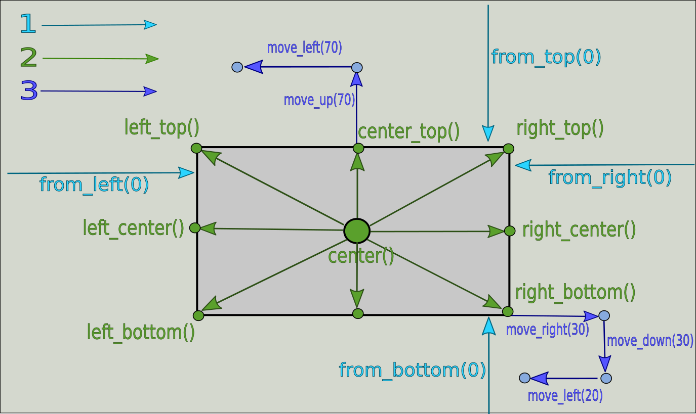

..  SPDX-License-Identifier: BSD-3-Clause
   
.. _mouse:

Действия с мышкой
=================

Действия с мышкой начинаются с ключевого слова ``mouse``, но в дальнейшем формат команды зависит от уточнения, какое именно действие необходимо выполнить. Практически все команды (за иключением ``mouse hold`` и ``mouse release``) связаны с возможностью перемещения курсора мыши в определенное место на экране монитора. Давайте рассмотрим способы определения места на экране, куда можно переместить курсор.

Способы перемещения курсора мыши (``destination``)
--------------------------------------------------

Координаты
++++++++++

Одним из способов перемещения курсора мыши являются **координаты**. Координаты выражаются в пикселях и представляют собой два числа, разделенные пробелом, в формате ``X Y``. Первое число отвечает за перемещение курсора по горизонтальной оси Х, а второе число - по вертикальной оси Y. Точка с координатами ``0 0`` находится в левом верхнем углу экрана.

Пример:

.. code-block:: none
	
	100 250 # Точка с координатами 100 по оси Х и 250 по оси Y

.. note ::
	Поведение курсора не определено в том случае, если координаты выводят его за пределы экрана. Например, если разрешение экрана составляет 800х600 пикселей, то поведение курсора определено в диапазоне [0-799] по оси Х и [0-599] по оси Y

Надпись на экране
+++++++++++++++++

Также указатель можно перемещать на центр надписи, если она присутствует на экране. В надписи можно использовать значения переменных. Центрирование курсора внутри найденной надписи происходит по обеим осям.

Примеры:

.. code-block:: none
	
	"Мой компьютер" # центр надписи "Мой компьютер"
	"${pic_name}.png"

Надпись на экране с дополнительными уточнениями
+++++++++++++++++++++++++++++++++++++++++++++++

В ряде случаев простого указания надписи может быть недостаточно для нужного позиционирования курсора. Например, на экране может быть несколько экземпляров искомой надписи (и тогда без уточненения непонятно, на какую именно из них нужно переместить курсор). Или требуется переместить курсор не на центр надписи, а на правый край надписи. Наконец, может потребоваться сдвинуть курсор на нужное количества пикселей от найденной надписи.
Платформа Testo позволяет указывать дополнительные уточнения при передвижении курсора мышки относительно надписей на экране.

Процесс выбора нужного места, в которое надо переместить, можно разделить на 3 этапа

	Схема уточнения места, куда нужно переместить курсор

**Шаг 1. Выбор нужного объекта (надписи)**

В случае, когда искомая надпись присутствует на экране более, чем в одном экземпляре, необходимо  уточнить, какая именно надпись нас интересует. Для этого существует четыре спецификатора:

1. ``from_bottom(N)`` - выбрать N-ную надпись **снизу**. ``from_bottom(0)`` означает самую нижнюю искомую надпись на экране
2. ``from_top(N)`` - выбрать N-ную надпись **сверху**. ``from_top(0)`` означает самую верхнюю искомую надпись на экране
3. ``from_left(N)`` - выбрать N-ную надпись **слева**. ``from_left(0)`` означает самую левую искомую надпись на экране
4. ``from_right(N)`` - выбрать N-ную надпись **справа**. ``from_right(0)`` означает самую правую искомую надпись на экране

.. note ::
	Если на экране присутствует ровно одна искомая надпись, шаг 1 можно пропустить

.. note ::
	Для определения положения объектов друг относительно друга используются координаты их геометрических центров

**Шаг 2. Позиционирование курсора внутри найденного объекта (надписи)**

.. note ::
	Если на экране несколько искомых надписей, тот этот шаг применим только после шага 1

По умолчанию после нахождения нужного объекта (надписи) курсор перемещается на геометрический центр этого объекта. Однако, иногда требуется передвинуть указатель в другое место внутри найденного объекта. Для этого существуют следующие спецификаторы:

1. ``left_bottom()`` - переместить указатель в левый нижний угол надписи
2. ``left_center()`` - переместить указатель в левый край надписи по центру
3. ``left_top()`` - переместить указатель в левый верхний угол надписи
4. ``center_bottom()`` - переместить указатель в нижний край надписи по центру
5. ``center()`` - переместить указатель в геометрический центр надписи (по умолчанию)
6. ``center_top()`` - переместить указатель в верхний край надписи по центру
7. ``right_bottom()`` - переместить указатель в правый нижний угол надписи
8. ``right_center()`` - переместить указатель в правый край надписи по центру
9. ``right_top()`` - переместить указатель в правый верхний угол надписи

.. note ::
	Позиционирование объекта выполняется даже в том случае, если спецификатор явно не указан. В этом случае будет неявно выполнено позиционирование center()

**Шаг 3. Финальное относительное позиционирование**

После позиционирования курсора внутри объекта

Результат работы javascript
+++++++++++++++++++++++++++

Наконец, можно указать цель перемещения курсора в виде результата работы скрипта на языке javascript. Скрипт обязательно должен возвращать один из следующих вариантов:
	- Объект, имеющий числовые свойства "x" и "y"
	- Массив объектов размером, имеющих числовые свойства "x" и "y". Массив должен иметь размер 0 или 1.

Внутри javascript-скрипта можно использовать результат работы встроенной функции ``detect_text`` (подробности см. :ref:`здесь <js_selections>`).

Примеры:

.. code-block:: none
	
	# передвинуть указатель мыши ны надпись "Hello world" синего цвета на сером фоне
	# будет работать, если такой надписи нет вовсе или если она присутствует
	# в единственном экземпляре
	js "detect_text('Hello world', 'blue', 'gray')" 

	#Передвинуть указатель в точку 200 400
	js "{'x': 200, 'y': 400}"

	#Найти все надписи "Hello world" на экране и
	#Передвинуть курсор на нижнюю из них
	# Такой скрипт будет работать независимо
	# От количества надписей "Hello world" на экране
	js """ arr = detect_text('Hello world')
	  if (arr.length) {
	      arr.sort(function (a, b) {
		    return a.Y < b.Y
		  });

		  arr[arr.length - 1]
	  } else {
	      arr
	  } """

mouse move
----------

Формат команды:

.. code-block:: none

	mouse move <destination> [timeout timeout_interval]

**Описание**
	Передвинуть указатель мыши в место на экране, укзанное в ``<destination>``. В случае, когда качестве ``destination`` используется строка или javascript, интерпретатор будет производить поиск нужной надписи на экране или будет выполнять javascript до тех пор (но не дольше ``timeout_interval``), пока ``destination`` не вернет хотя бы один объект. Если ``destination`` при этом возвращает 2 или более объектов, то команда завершается с ошибкой.

**Аргументы**:

	- ``destination`` - Указание места на экране, куда нужно переместить курсор мыши
	- ``timeout_interval`` - Тип: временной интервал. Максимальное время ожидания подходящего ``destination``. Значение по-умолчанию - одна минута. Значение по умолчанию можно поменять с помощью служебного параметра ``TESTO_MOUSE_MOVE_CLICK_DEFAULT_TIMEOUT``. Подробности см. :ref:`здесь <param>`

Примеры:

.. code-block:: none

	#Сработает в любом случае
	mouse move 400 0

	#Сработает только в том случае, если надпись "Корзина" появится на экране
	#В единственном экземпляре в течение 1 минуты
	mouse move "Корзина"

	#Сработает только в том случае, если надпись "Hello world" в синем шрифте
	# на белом фоне появится на экране в единственном экземпляре в течение 3 минут
	mouse move js "detect_text('Hello world', 'blue', 'white')" timeout 3m

mouse click(lckick, rclick, dclick)
-----------------------------------

Формат команды:

.. code-block:: none

	mouse <click_type> [destination] [timeout timeout_interval]

**Описание**
	Выполнить нажатие, указанное в ``click_type``. Если указан ``[destination]`` - то предварительно будет выполнено перемещение курсора мыши в нужное место на экране. Дополнительную информацию см. в ``mouse move``

**Аргументы**:

	- ``click_type`` - Тип нажатия на кнопки мыши. ``click`` (или ``lclick``) - нажать на левую кнопку мыши, ``rclick`` - нажать на правую кнопку мыши, ``dclick`` - дважды нажать на левую кнопку мыши.
	- ``destination`` - Указание места на экране, куда нужно переместить курсор мыши
	- ``timeout_interval`` - Тип: временной интервал. Максимальное время ожидания подходящего ``destination``. Значение по-умолчанию - одна минута. Значение по умолчанию можно поменять с помощью служебного параметра ``TESTO_MOUSE_MOVE_CLICK_DEFAULT_TIMEOUT``. Подробности см. :ref:`здесь <param>`

mouse hold
----------

Формат команды:

.. code-block:: none

	mouse hold <button>

**Описание**
	Зажать кнопку мыши, указанную в ``button``.

**Аргументы**:

	- ``<button>`` - Кнопка мыши, которую надо зажать. Возможные значения: ``lbtn``, ``rbtn``

.. warning ::
	Запрещается нажимать более одной кнопки мыши

.. warning ::
	Запрещается выполнять действия click при зажатой кнопке мыши

.. warning ::
	К моменту окончания теста кнопки мыши не должны быть зажаты

mouse release
-------------

Формат команды:

.. code-block:: none

	mouse release

**Описание**
	Отпустить текущую зажатую кнопку мыши
	