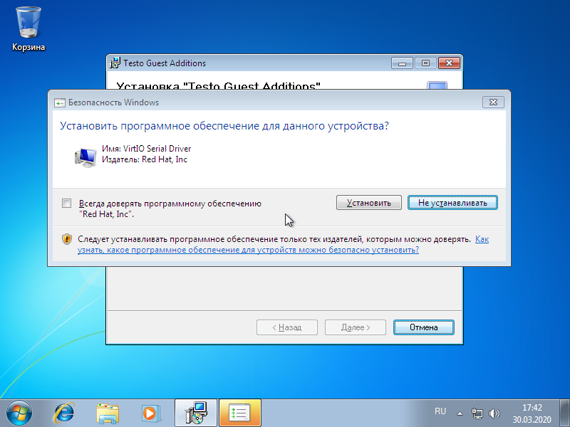
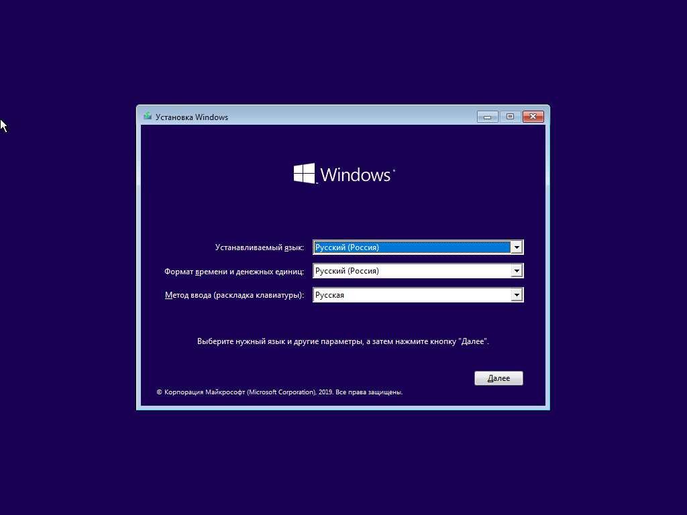

..  SPDX-License-Identifier: BSD-3-Clause
   
.. _mouse:

Действия с мышкой
=================

Действия с мышкой начинаются с ключевого слова ``mouse``, но в дальнейшем формат команды зависит от уточнения, какое именно действие необходимо выполнить. Практически все команды (за иключением ``mouse hold`` и ``mouse release``) связаны с возможностью перемещения курсора мыши в определенное место на экране монитора. Давайте рассмотрим способы определения места на экране, куда можно переместить курсор.

Способы перемещения курсора мыши (``destination``)
--------------------------------------------------

Координаты
++++++++++

Одним из способов перемещения курсора мыши являются **координаты**. Координаты выражаются в пикселях и представляют собой два числа, разделенные пробелом, в формате ``X Y``. Первое число отвечает за перемещение курсора по горизонтальной оси Х, а второе число - по вертикальной оси Y. Точка с координатами ``0 0`` находится в левом верхнем углу экрана.

Пример:

.. code-block:: none
	
	100 250 # Точка с координатами 100 по оси Х и 250 по оси Y

.. note ::
	Поведение курсора не определено в том случае, если координаты выводят его за пределы экрана. Например, если разрешение экрана составляет 800х600 пикселей, то поведение курсора определено в диапазоне [0-799] по оси Х и [0-599] по оси Y

Надпись на экране
+++++++++++++++++

Также указатель можно перемещать на центр надписи, если она присутствует на экране. В надписи можно использовать значения переменных. Центрирование курсора внутри найденной надписи происходит по обеим осям.

Примеры:

.. code-block:: none
	
	"Мой компьютер" # центр надписи "Мой компьютер"
	"${pic_name}.png"

Надпись на экране с дополнительными уточнениями
+++++++++++++++++++++++++++++++++++++++++++++++

В ряде случаев простого указания надписи может быть недостаточно для нужного позиционирования курсора. Например, на экране может быть несколько экземпляров искомой надписи (и тогда без уточненения непонятно, на какую именно из них нужно переместить курсор). Или требуется переместить курсор не на центр надписи, а на правый край надписи. Наконец, может потребоваться сдвинуть курсор на нужное количества пикселей от найденной надписи.
Платформа Testo позволяет указывать дополнительные уточнения при передвижении курсора мышки относительно надписей на экране.

Процесс выбора нужного места, в которое надо переместить, можно разделить на 3 этапа

.. figure:: img/mouse_specifiers_1.png

	Схема уточнения места, куда нужно переместить курсор

**Шаг 1. Выбор нужного объекта (надписи)**

В случае, когда искомая надпись присутствует на экране более, чем в одном экземпляре, необходимо  уточнить, какая именно надпись нас интересует. Для этого существует четыре спецификатора:

1. ``from_bottom(N)`` - выбрать N-ную надпись **снизу**. ``from_bottom(0)`` означает самую нижнюю искомую надпись на экране
2. ``from_top(N)`` - выбрать N-ную надпись **сверху**. ``from_top(0)`` означает самую верхнюю искомую надпись на экране
3. ``from_left(N)`` - выбрать N-ную надпись **слева**. ``from_left(0)`` означает самую левую искомую надпись на экране
4. ``from_right(N)`` - выбрать N-ную надпись **справа**. ``from_right(0)`` означает самую правую искомую надпись на экране

.. note ::
	Если на экране присутствует ровно одна искомая надпись, шаг 1 можно пропустить

.. note ::
	Для определения положения объектов друг относительно друга используются координаты их геометрических центров

**Шаг 2. Позиционирование курсора внутри найденного объекта (надписи)**

.. note ::
	Если на экране несколько искомых надписей, тот этот шаг применим только после шага 1

По умолчанию после нахождения нужного объекта (надписи) курсор перемещается на геометрический центр этого объекта. Однако, иногда требуется передвинуть указатель в другое место внутри найденного объекта. Для этого существуют следующие спецификаторы:

1. ``left_bottom()`` - переместить указатель в левый нижний угол надписи
2. ``left_center()`` - переместить указатель в левый край надписи по центру
3. ``left_top()`` - переместить указатель в левый верхний угол надписи
4. ``center_bottom()`` - переместить указатель в нижний край надписи по центру
5. ``center()`` - переместить указатель в геометрический центр надписи (по умолчанию)
6. ``center_top()`` - переместить указатель в верхний край надписи по центру
7. ``right_bottom()`` - переместить указатель в правый нижний угол надписи
8. ``right_center()`` - переместить указатель в правый край надписи по центру
9. ``right_top()`` - переместить указатель в правый верхний угол надписи

.. note ::
	Позиционирование объекта выполняется даже в том случае, если спецификатор явно не указан. В этом случае будет неявно выполнено позиционирование center()

**Шаг 3. Финальное относительное позиционирование**

После позиционирования курсора внутри объекта существует возможность передвинуть указатель на фиксированное количество пикселей по осям X и Y. Для этого существуют следующие спецификаторы:

1. ``move_left(N)`` - переместить курсор на N пикселей влево
2. ``move_right(N)`` - переместить курсор на N пикселей вправо
3. ``move_up(N)`` - переместить курсор на N пикселей вверх
4. ``move_down(N)`` - переместить курсор на N пикселей вниз

**Применение спецификаторов**

Спецификаторы применяются с помощью **точки**. Для применения спецификатора к результату поиска строки на экране (который возвращает массив найденных объектов) нужно после искомой строки поставить точку и указать необходимый спецификатор. Например, ``"Искомая строка".from_top(0)``. Дальнейшие спецификаторы также необходимо указывать через точку: ``"Искомая строка".from_top(0).right_bottom().move_left(10).move_up(70)``.

.. note ::
	В рамках позиционирования спецификаторы из первого и второго шагов могут быть применены только один раз. Спецификаторы из третьего шага можно применять в неограниченном количестве.

Результат работы javascript
+++++++++++++++++++++++++++

Наконец, можно указать цель перемещения курсора в виде результата работы скрипта на языке javascript. Скрипт обязательно должен возвращать объект, имеющий числовые свойства "x" и "y".

Внутри javascript можно использовать результат работы встроенной функции ``find_text``, которая возвращает все найденные на экране строки. Полученные строки затем можно фильтровать с помощью различных методов (подробности см. :ref:`здесь <js>`).

В конечном счете, процесс работы со строками в javascript довольно похож на применение встроенных в язык Testo-lang спецификаторов. Начиная с поиска множества объектов, необходимо с помощью уточняющих действий прийти к формированию конечной точки (объекта с полями ``x`` и ``y``), которую и необходимо возвратить в качестве результата работы javascript. Эта точка будет означать место назначения для премещения курсора.

..note ::
	Если javascript в ходе своей работы завершился с какой-либо ошибкой, то команда mouse также прекратит свою работу, бросив соответствующее исключение.

Примеры:

.. code-block:: none
	
	# передвинуть указатель мыши на центр надписи "Hello world" синего цвета на сером фоне
	# Сработает только если такая надпись находится на экране в единственном экземпляре
	js "find_text().match('Hello world').foreground('blue').background('grey').center()" 

	# передвинуть указатель мыши на 20 пикселей от правого края самой нижней надписи "Hello world"
	js "find_text().match('Hello world').from_bottom(0).right_center().move_right(20)" 

	#Передвинуть указатель в точку 200 400
	js "{'x': 200, 'y': 400}"

mouse move
----------

Формат команды:

.. code-block:: none

	mouse move <destination> [timeout timeout_interval]

**Описание**
	Передвинуть указатель мыши в место на экране, укзанное в ``<destination>``. В случае, когда качестве ``destination`` используется строка или javascript, интерпретатор будет производить поиск нужной надписи на экране или будет выполнять javascript до тех пор (но не дольше ``timeout_interval``), пока ``destination`` не вернет хотя бы один объект. Если ``destination`` при этом возвращает 2 или более объектов, то команда завершается с ошибкой.

**Аргументы**:

	- ``destination`` - Указание места на экране, куда нужно переместить курсор мыши
	- ``timeout_interval`` - Тип: временной интервал. Максимальное время ожидания подходящего ``destination``. Значение по-умолчанию - одна минута. Значение по умолчанию можно поменять с помощью служебного параметра ``TESTO_MOUSE_MOVE_CLICK_DEFAULT_TIMEOUT``. Подробности см. :ref:`здесь <param>`

mouse click(lckick, rclick, dclick)
-----------------------------------

Формат команды:

.. code-block:: none

	mouse <click_type> [destination] [timeout timeout_interval]

**Описание**
	Выполнить нажатие, указанное в ``click_type``. Если указан ``[destination]`` - то предварительно будет выполнено перемещение курсора мыши в нужное место на экране. Дополнительную информацию см. в ``mouse move``

**Аргументы**:

	- ``click_type`` - Тип нажатия на кнопки мыши. ``click`` (или ``lclick``) - нажать на левую кнопку мыши, ``rclick`` - нажать на правую кнопку мыши, ``dclick`` - дважды нажать на левую кнопку мыши.
	- ``destination`` - Указание места на экране, куда нужно переместить курсор мыши
	- ``timeout_interval`` - Тип: временной интервал. Максимальное время ожидания подходящего ``destination``. Значение по-умолчанию - одна минута. Значение по умолчанию можно поменять с помощью служебного параметра ``TESTO_MOUSE_MOVE_CLICK_DEFAULT_TIMEOUT``. Подробности см. :ref:`здесь <param>`

mouse hold
----------

Формат команды:

.. code-block:: none

	mouse hold <button>

**Описание**
	Зажать кнопку мыши, указанную в ``button``.

**Аргументы**:

	- ``<button>`` - Кнопка мыши, которую надо зажать. Возможные значения: ``lbtn``, ``rbtn``

.. warning ::
	Запрещается нажимать более одной кнопки мыши

.. warning ::
	Запрещается выполнять действия click при зажатой кнопке мыши

.. warning ::
	К моменту окончания теста кнопки мыши не должны быть зажаты

mouse release
-------------

Формат команды:

.. code-block:: none

	mouse release

**Описание**
	Отпустить текущую зажатую кнопку мыши

Примеры
-------

**Простые примеры**

.. code-block:: none

	#Передвинуть курсор на позицию "Х:400, Y:0"
	#Сработает в любом случае
	mouse move 400 0

	#Выполнить правый клик по надписи "Корзина"
	#Сработает только в том случае, если надпись "Корзина" появится на экране
	#В единственном экземпляре в течение 1 минуты
	mouse rclick "Корзина"

**Пример 1**

Задача: кликнуть на надпись "Установить", выделенную красным цветом

Всего на экране присутствует 3 надписи "установить", поэтому простой запрос ``mouse click "Установить"`` не сработает. Однако, мы можем уточнить, какая именно надпись нас интересует, с помощью спецификаторов ``from``. В данном случае удобнее всего воспользоваться спецификатором ``from_top``:

.. code-block:: none

	#Кликнуть на вторую сверху надпись "Установить"
	mouse click "Установить".from_top(1)

**Пример 2**

Задача: кликнуть на область, выделенную красным цветом

Для клика на заданную область необходимо отталкиваться от близлежащих к этой области надписей. В данном случае можно использовать надпись "Предпочитаемый DNS-сервер".
Однако ели выполнить поиск этой надписи, то курсор будет спозиционирован в центр этого объекта. Но для перехода на нужную красную область гораздо удобнее использовать правый край надписи "Предпочитаемый DNS-сервер". Для этого можно применить спецификатор ``right_center()``. Затем, отталкиваясь от правого края надписи "Предпочитаемый DNS-сервер", мы можем сдвинуть указатель на несколько пикселей вправо, чтобы попасть в нужную область.

.. code-block:: none

	mouse click "Предпочитаемый DNS-сервер".right_center().move_right(30)

.. note ::
	Можно заметить, что в этом примере не используется спецификатор from, т.к. искомая надпись на экране представлена в единственном экземпляре.

