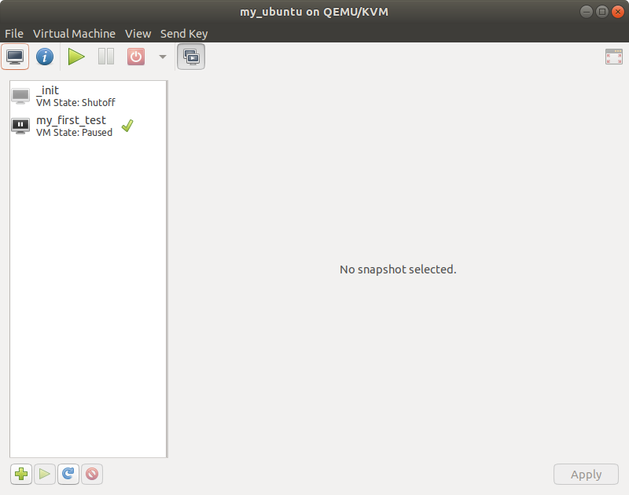

# Tutorial 1. The very first test

## What you're going to learn

In this guide you're going to learn:

1. The basics of virtual machines declaration and creation.
2. Command-line argument `stop_on_fail`.
3. Testo clean mode basics (`testo clean`).

## Preconditions

1. Testo Framework is [installed](../../../README.md#installation).
3. [Ubuntu server 16.04](https://releases.ubuntu.com/16.04/ubuntu-16.04.7-server-amd64.iso) image is downloaded and located here: `/opt/iso/ubuntu_server.iso`. The location may be different, but in this case the test scripts have to be adjusted accordingly.
4. (Recommended) [Syntax highlighting](../../../README.md#syntax-highlighting) for your text editor is set up.

## Introduction

Testo is a system tests automation framework. The main concept of system testing is that such tests cover not just the software itself, but the whole system, where the software is just a little part of the whole picture. System tests let you check how well your software operates in various circumstances and surroundings. A surrounding could mean a lot of things: Operating System, network connections (Internet included), presence or absence of certain hardware and so on. A very fine example of a system test - checking a software installator in various OS versions.

And so, in Testo Framework a System Under Test (SUT) consists not of a single program, but the whole virtual **test bench**, which includes virtual machines, virtual flash drives and virtual networks.

The simpliest test bench contains only one **virtual machine**. This is the most minimal virtual infrastructure the Testo Framework can operate on.

Test scripts imply not only the test bench (SUT) declarations, but also the actions descriptions that need to be performed to the SUT. Basically, testing can be represented as consequtive applying actions to the SUT and comparing the actual outcome with the expected results.

When talking about system (e.g. complex) tests, it is generally understood that such tests should be done by humans. Because only a human can perform all the actions necessary for the system tests (which are not only simple mouse/keyboard operations, but also specific "hardware" actions: plugging/unplugging flash drives, network links, power control and so on). And only a human can make a decision, whether the system reactions to his actions are correct or not.

And because of that, in the Testo Framework test scripts are basically a list of actions, that a real human could do when testing a SUT. Moreover, the test scenarios begin with creating and preparing a virtual test bench - because that's what a real human would do. And only after all the machines are created and set up, the real complex test cases could be performed. However, sometimes even an OS installation could be considered a real complex test case (if you are developing your own OS).

Let's check out an example.

## What to begin with?

So you want to develop a test script using Testo Framework. How do you begin?

All the test scrits are stored in regular text files with the `.testo` extension. The test scripts consist of two large parts:
1. Virtual test bench declaration.
2. Describing actions to be applied to the declared test bench.

And so, developing a test script starts with the virtual test bench declaration. To declare a virtual entity you should use special directives: `machine` (virtual machine declaration), `flash` (virtual flash drive declaration) and `network` (virtual network declaration). In this guide we will use only a virtual machine declaration.

Let's create an empty file `~/testo/hello_world.testo` and declare our own first [virtual machine](../../reference/Machines.md):

```testo
machine my_ubuntu {
	cpus: 1
	ram: 512Mb
	disk main: {
		size: 5Gb
	}
	iso: "/opt/ubuntu_server.iso"
}
```

A virtual machine declaration starts with the keyword `machine` followed by a name for your virtual machine. The name must be unique for all the virtual entities (machines, flash dirves and networks) in the test project.

A virtual machine has several attributes. Some attributes are mandatory, some are optional. There are only 3 mandatory attributes: `cpus`, `ram` and `disk`. The `iso` attribute is optional, but we will need it for the test scripts in our guides. Let's take a closer look at the attributes.

-	`cpus`: number of CPU cores for the virtual machine.
-	`ram`: amount of RAM-memory for the virtual machine.
-	`iso`: a path to the iso-image to be plugged inside the DVD-drive of the virtual machine after its creation.
-	`disk main`: Hard disk settings for the virtual machine. A Hard disk could be configured in two modes: a new black disk creation and importing an existing one. Right now we're going to learn only the first mode. To activate this mode you need to specify the `size` subattribute, which stands for the desired size of the disk. Take notice of, that the `disk` attribute must have a name - in our case it is `main`. If necessary, we could have added more disks to our virtual machine.

Our first virtual machine is Ubuntu Server 16.04 with 1 CPU core, 512 MB of RAM and 1 hard disk with 5 GB size. With the `iso` attrbiute we specify the installation image of the Ubuntu Server, which is mounted in virtual DVD-drive right after its creation.

You could also notice, that we used [special literals](../../reference/Language%20lexical%20elements.md#memory-size-literals), which lets us specify the memory amount in a simple and convenient way.

We will get accustomed to other optional attributes in the future guides.

## Let's run it!

So we've declared our first virtual test bench for the first test project. Let's try to run this script.

If everything is done correctly, you should see the following interpreter's output:


We can see, that even though we haven't written a single test just yet, the `.testo` file is still can be interpreted. However, no tests are run at the moment (obviously).

Now you could open the virtual manager and check the list of created virtual machines. For now you can't see the `ubuntu_server` virtual machine, which we just declared. It is because **the virtual machine declaration doesn't mean its actual creation**. A declaration just tells Testo Framework that you want to use a particular virtual machine with a particular set of attributes in one of your tests, and that you reference this machine with that particular name.

## The very first test

The actual virtual machine creation is done during **test** runs. In Testo Framework tests contain not just the actual testing actions with virtual machines, but **all** the actions being done with virtual machines, even if you are 100% certain that these actions could not fail in any way. In other words, **if you want to do something with a virtual machine - do it inside the tests**.

A [test](../../reference/Tests.md) declaration starts with the `test` keyword. Each test must have a unique name. Let's add a test declaration to our file `~/testo/hello_world.testo`

```testo
machine my_ubuntu {
	cpus: 1
	ram: 512Mb
	disk main: {
		size: 5Gb
	}
	iso: "/opt/iso/ubuntu_server.iso"
}

test my_first_test {
	my_ubuntu start
}
```

A test itself is just basically a set of commands. A command has two parts:

1. A virtual entity name (a virtual machine or virtual flash drive).
2. Actions to be applied to the virtual machine or the flash drive.

Commands with flash drives are described in future guides. Right now we're going to focus on the virtual machine commands.

In our first test there is only one command. In this command the [`start`](../../reference/Actions.md#start) action is applied to the virtual machine `my_ubuntu`. Let's run this test and see what we've got.

<Asset id="terminal2"/>

We can see that the `my_first_test` test is queued into `TESTS TO RUN`, which means that Testo is ready to run this test. After that the actual test run begins.

A test run is a four-step process:

1. Validating the test cache.
2. Preparing the running environment.
3. Applying commands.
4. Staging the running environment.

Step 1 we skip for now because we have no cache just yet, so let's move on to the step 2.

The main goal of the step 2 is to ensure that all the virtual infrastructure is created and ready for the commands application.

In our case Testo can see that there is a reference to the virtual machine `my_ubuntu` inside the test. Since this machine doesn't exist just yet, Testo creates it with the settings described in the attibute section of its declaration. Right after the creation, the state of `my_ubuntu` is staged with the snapshot `initial`. After that the testing environment is ready, and we can move on to the step 3.

Virtual machines are created in the powered off state, and so usually the first thing you want to do, is to start them. That is exactly what happens in the only command `my_ubuntu start`. Now the step 3 is complete and we move on to the step 4.

If a test completes successfully, a snapshot is created for every virtual entity involved in the test. The snapshots have the name of the successfully completed test. We can see that in the interpreter output.

With the step 4 finished, the test is considered complete. Since we don't have any more planned tests to run, `testo` exits.

If you open machines list in virt manager now, you'll see a new machine - `ubuntu_server`. But it is powered off. You may ask yourself, why the machine is powered off, when we clearly instructed Testo to turn it on?

As a matter of fact, the virtual machine had been powered on during the test and then was staged in that state with the `my_first_test` snapshot. You may open the snapshots menu of the virtual machine and see that for yourself.



But at the end of the test `my_first_test` Testo detected, that `my_ubuntu` virtual machine won't be used anymore and powered it off to save the system resources. And that's why we see our virtual machine in the powered off state.

## `--stop_on_fail` command line argument

But what if we want to take a look at our virtual machine in the state it was at the end of the test? What if we want to see our virtual machine powered on?

We need to take 2 steps to do that.

First, let's add a new action to the test: [`abort`](../../reference/Actions.md#abort)

```testo
test my_first_test {
	my_ubuntu {
		start
		abort "Stop here"
	}
}
```

Our test still has only one command, but this command now has an action block as the action. The new `abort` action stops the test run with an error message. Let's try to run this test now:

<Asset id="terminal3"/>

We can see a warning about the cache loss for the test `my_first_test`. Caching is explained in the future guides, for now it is enough to just accept the warning.

Now our test is considered `FAILED`, we can see the exact place in the test script where the error occured. It is an expected error, since we placed the `abort` action in the test.

However, if we open virtual manager and take a look at the `my_ubuntu` virtual machine, we will find it powered off, even though the test hasn't finished successfully (in the snapshot menu there is no `my_first_test` snapshot now). And again, the reason is that Testo turn off virtual machines right after when they are no longer of use for the test run. Even if they are no longer of use because of errors.

And still, there is a way to abort the tests run when any error occurs. To do that you need to pass the command line argument `--stop_on_fail`.

<Asset id="terminal4"/>

And now, at last, in the virtual manager we can find our machine in the next state:


The combination `abort` + `stop_on_fail` constitues the breakpoint mechanism in Testo. With such "breakpoints" you can stop the tests runs and take a look at your virtual test bench at any moment you like.

## `testo clean` command

During tests run Testo created a virtual machine (`my_ubuntu`), which will exist in the Host filesystem indefinitely long. If we want to clear the disk space and get rid of the created machine, we should use the Testo cleaning mode. With just a simple command

<Asset id="terminal5"/>

the virtual machine `my_ubuntu` is gone.

> `testo clean` doesn't delete manually created entities. Only the Testo-created infrastructure is erased.
