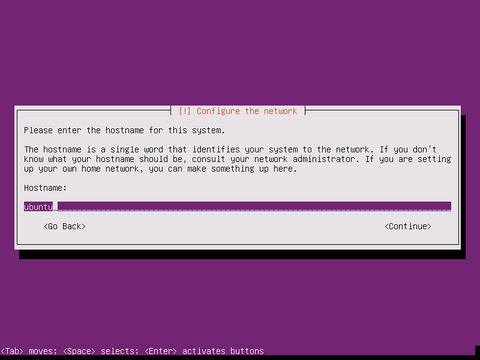
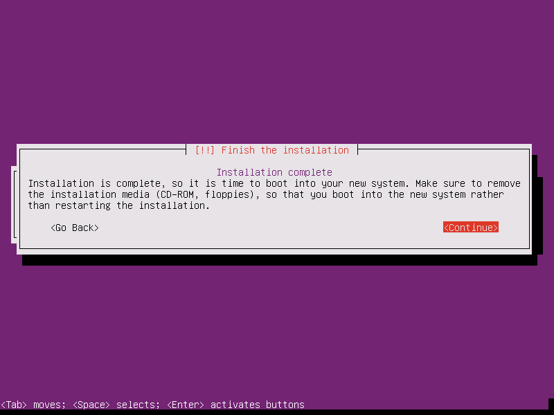

# Tutorial 2. Ubuntu Server Installation

## What you're going to learn

In this tutorial you're going to learn the most basic virtual machine actions in Testo lang: `wait`, `type`, `press`. Additionally you're going to learn how to eject the DVD-drive from a virtual machine.

## Introduction

The last tutorial ended with the successful declaration of the virtual machine `my_ubuntu` and development of the very first test, where the virtual machine is just created and started. But now new questions come to mind: what to do next with the virtual machine? How to automate the OS installation?

As previously mentioned, Testo Framework is aimed at mimicking a human, working with a computer. When developing test scripts, you could use a lot of actions that a real human would do when sitting behind a monitor with a keyboard and a mouse.

Let's consider an example. After the virtual machine has started, the user (a human) can see the next screen:


When the user recognizes this screen, he understands that now he has to take some action. In this case he understands, that it is nesseccary to press the Enter key on the keyboard. After that he waits for the next screen


Now it's the time to press Enter again... and wait for the next screen... This routine repeats until the the Ubunstu Server installation is complete.

To think about it, the concept of a human working with a computer could be represented as a two-step process:

1. Waiting for an event to appear (screen contents detection).
2. A reaction to this event (pressing keys on the keyboard for example).

The main concept of Testo-lang is to automate and formalize such an algorithm.

## What to begin with?

Let's try to understand this concept with an example. For that, let's go back to the script we've developed in the tutorial 1.

```testo
machine my_ubuntu {
	cpus: 1
	ram: 512Mb
	disk main: {
		size: 5Gb
	}
	iso: "/opt/iso/ubuntu_server.iso"
}

test my_first_test {
	my_ubuntu {
		start
		abort "Stop here"
	}
}
```

After the virtual machine starts, we can see the screen with the language selection. When this screen shows up, we need to press Enter (cause we're OK with English language, which is the default choice).

First, we need to make sure that the language screen has actually appeared. There is a special [`wait`](../../reference/Actions.md#wait) action in Testo-lang for waiting an event to appear on the screen.

With the `wait` action we can wait for a text (or a combination of texts) to appear on the screen. In our case we have to wait for a text, let's say, "English". This text is enough for us to know that the Language selection screen has indeed showed up.

```testo
test my_first_test {
	my_ubuntu {
		start
		wait "English"
		abort "Stop here"
	}
}
```

The `wait` action blocks the test run and returns the control only when the "English" text is detected. Let's try to run this test


Keep in mind that the `abort` action is still there, providing us with the breakpoint in our test script. This makes the test development process more convinient: we can always see the virtual machine state at the moment the `abort` triggers.

Now when we've made sure that a certain screen is really in front of us (on the monitor) we're ready to make some reaction to this event. In our case we need to press the Enter key to select English language. There is the [`press`](../../reference/Actions.md#press) action in the Testo-lang, allowing you to press a keyboard button(s).

```testo
test my_first_test {
	my_ubuntu {
		start
		wait "English"
		press Enter
		abort "Stop here"
	}
}
```

Output:


Now if you open the `my_ubuntu` virtual machine in virtual manager, you'll find out that the Ubuntu installation has, indeed, moved a bit further: now we can see the second screen with the installation choices.

Just like a moment ago, first we need to make sure that we really can see the expected screen. We can do that with the `wait "Install Ubuntu Server"` action (for example). After that we're ready to press Enter once again.

Now you can see the pattern: developing a test script is a combination of "wait for something" - "react" actions. It looks something like this:


## wait timeout

As previously mentioned, `wait` actions don't return the control until the expected text appears on the screen. But what if the expected text never shows up? This could happen when, for example, we are testing software initialization and expect to see a "Success" message, but the software has a bug, fails and shows us the "Error" message. In this case the `wait` action won't lock up the test forever, because it has a timeout with the default value of 1 minute. To specify time intervals there are [special literals](../../reference/Language%20lexical%20elements.md#time-interval-literals) available in Testo lang:

```testo
test my_first_test {
	my_ubuntu {
		start
		wait "English" timeout 1m # This is the same as just wait "English"
		press Enter
		abort "Stop here"
	}
}
```

Let's make sure that the `wait` action doesn't return the control until the expected text is found on the screen. Let's try to find something ridiculous instead of "English". To avoid waiting for too long let's set the timeout to 10 seconds.

```testo
test my_first_test {
	my_ubuntu {
		start
		wait "ALALA" timeout 10s
		press Enter
		abort "Stop here"
	}
}
```

Output:


We can see the error has moved up a bit: not on the `abort` action, but on the `wait`.

## type

If we continue to automate the Ubuntu installation, then on this step:

```testo
test my_first_test {
	my_ubuntu {
		start
		wait "English";
		press Enter;
		wait "Install Ubuntu Server"; press Enter;
		wait "Choose the language";	press Enter
		wait "Select your location"; press Enter
		wait "Detect keyboard layout?";	press Enter
		wait "Country of origin for the keyboard"; press Enter
		wait "Keyboard layout"; press Enter
		wait "No network interfaces detected" timeout 5m

		# Take notice of that you you want to press several keys one after another
		# you can combine them in one press action using a comma
		press Right, Enter
		wait "Hostname:"
		abort "Stop here"
	}
}
```

We will see the screen with the Hostname selection



Of course, we can leave the default value, but what if we want to enter a different hostname value?

To achieve that, we need to do 2 things:
1. Erase the current value.
2. Enter the new value.

To erase the existing value we need to press the Backspace key at least 6 times. But it would look pretty messy to just duplicate the `press` action 6 times, so instead you can use a single `press` action like this: `press Backspace*6`. In fact nothing prevents us from pressing the backspace buttom more than 6 times (for example 20 times) as we usually do when we enter the text manualy.

Now we need to enter a new Hostname value (`my-ubuntu`, for example). Though it is possible to do that with only the `press` actions (`press m; press y...`), it would look super ugly. But, luckily, in Testo-lang you can use the [`type`](../../reference/Actions.md#type) action to type text on the keyboard.

So our task may be done with a simple `type "my-ubuntu"` action.

Likewise a bit later you can enter the login (`type "my-ubuntu-login"`) and password (`type "1111"`).

## Completing the installation

Finally at some point we're going to see the Installation Complete screen, prompting us to remove the installation media and press Enter to continue.



So how can you remove the installation media (e.g. "eject" the DVD-drive)? Testo Framework has actions mimicking hardware manipulations, mainly the plugging ([`plug`](../../reference/Actions.md#plug) action) and the unplugging ([`unplug`](../../reference/Actions.md#unplug) action) different devices. Right now we are going to use the `unplug dvd` action, which "ejects" the virtual DVD-drive, thus removing the mounted iso-image. Other plug/unplug possibilities will be explained in the future tutorials.

After ejecting the DVD-drive, all that's left to do is to wait for the restart to complete. We can reckon that the installation completed successfully, if after the restart the login prompt appears (`wait "login"`). Just to be absolutely sure, at the end of the test we're going to login in the system with the login/password we specified.

```testo
test my_first_test {
	my_ubuntu {
		...

		wait "Installation complete" timeout 1m;
		unplug dvd; press Enter
		wait "login:" timeout 2m; type "my-ubuntu-login"; press Enter
		wait "Password:"; type "1111"; press Enter
		wait "Welcome to Ubuntu"
	}
}
```

Now we can remove the brekpoint `abort "stop here"` at the end of the test and, thus, finally, complete the test `my_first_test`.

Congratulations! You've just developed a test script which installs the Ubuntu Server 16.04 on a freshly created virtual machine from complete scratch!
