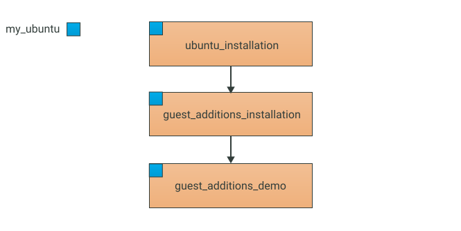

# Tutorial 5. Caching

## What you're going to learn

In this tutorial you're going to learn about tests caching in Testo-lang.

## Introduction

A lot of tests written in Testo-lang can take a significant time for execution (especially - OS installation). To avoid re-running tests without real necessity Testo Framework has a [caching technology](../../reference/Tests.md#snapshots-and-tests-caching-technology).

## What to begin with?

In the last tutorial we've encountered a situation when all the tests were cached and wouldn't run again even after we replaced some string constants with param references. To understand why it happened we need to consider an example.

Let's take a look at our test hierarchy which we've developed during the last tutorial.



First we need to run all the tests to make sure they are all cached. If any tests weren't cached, then let them complete, and run the Testo again with the same arguments.

In the end you'll see the next output:


And now let's experiment a little with out test scripts and see what's going to happen with the cache.

First let's try to modify the actions in the `guest_additions_demo` test:

```testo
test guest_additions_demo: guest_additions_installation {
	my_ubuntu {
		# Modified bash script
		exec bash """
			echo Modified Hello world
			echo from bash
		"""
		# Double quotes require the escape symbol in one-line strings
		exec python3 "print(\"Hello from python3!\")"
	}
}
```

Now run the script and check out the output:


Pretty much as expected, the test modification resulted in the cache loss for the test. However, you can see that only the child-test `guest_additions_demo` was run. That happened because the `guest_additions_installation` test still had the valid cache, so Testo was able to restore the `my_ubuntu` virtual machine state from the `guest_additions_installation` snapshot, which had been created earlier during the run of the corresponding test.

Adding empty lines, tabs and comments doesn't affect the cache validity. Try to add or remove several empty lines or comments and see for yourself.

Now let's move on to the `guest_additions_installation` test. In this test we're going to use a param reference in the string specifying the deb-package.

```testo
param guest_additions_pkg "*.deb"
test guest_additions_installation: ubuntu_installation {
	my_ubuntu {
		plug dvd "${ISO_DIR}/testo-guest-additions.iso"

		type "sudo su"; press Enter;
		# Take a note that you may reference params in any part of the string
		wait "password for ${login}"; type "${password}"; press Enter
		wait "root@${hostname}"

		type "mount /dev/cdrom /media"; press Enter
		wait "mounting read-only"; type "dpkg -i /media/${guest_additions_pkg}"; press Enter;
		wait "Setting up testo-guest-additions"
		type "umount /media"; press Enter;
		# Give a little time for the umount to do its job
		sleep 2s
		unplug dvd
	}
}
```

After running the script one more time we'll see this:


Which means that all tests are cached, despite that we've clearly modified one of the tests! We encountered the same situation during the previous tutorial. So what's the deal?

The thing is, when calculating checksums for tests cache, Testo takes into consideration only the **final** string values, after all the param references are resolved. Before we changed the string (by inserting the param reference), the action'd looked like `type "dpkg -i /media/*.deb"`. After the modificaiton and the param reference resolving, the action still looks exactly the same. And that's the reason why the cache is considered valid, despite visible modificaiton. That's what we saw in the last tutorial.

But let's change the param value:

```testo
param guest_additions_pkg "testo-guest-additions.deb"
test guest_additions_installation: ubuntu_installation {
	my_ubuntu {
		...
	}
}
```

Run the script again. If you don't want to accept the cache loss manually every time, you may want to use the `--assume_yes` command line argument.


Naturally, the `guest_additions_installation` test lost its cache, since the `guest_additions_pkg` value had changed. It is also worth noticing that the child-test `guest_additions_demo` lost its cache as well, even though we hadn't touched it in any way.

## File checksums in `copyto` and `plug dvd` actions

In the tutorial 3 we mentioned, that the guest additions unlock a few new high-level actions, including the `copyto` action, which allow to copy files from the Host system to virtual machines in your test scripts. Let's take a look at this action.

Let's assume that we need to copy a small text file inside the virtual machine. Create a file in the same folder where the `hello_world.testo` script is located.

The test itself needs to be modified.

```testo
test guest_additions_demo: guest_additions_installation {
	my_ubuntu {
		# Modified bash script
		exec bash """
			echo Modified Hello world
			echo from bash
		"""
		# Double quotes require the escape symbol in one-line strings
		exec python3 "print(\"Hello from python3!\")"

		copyto "./testing_copyto.txt" "/tmp/testing_copyto.txt"
		exec bash "cat /tmp/testing_copyto.txt"
	}
}
```


The `copyto` action takes two arguments: the file we want to copy (since it is located near the test script file itself, we can specify the relative path `./`) and the **full** abosulute path **including the destination file name**, specifying where we want to put our file on the virtual machine filesystem.

Run this script and make sure it is cached.

Now comes an important moment. As previously mentioned, when calculating the test checksums, Testo takes into account files involved in the test. The checksums are calculated following the next algorithm:

1. If the file size is less than 1 megabyte, then the checksum is calculated based on the **contents** of the file;
2. If the file size is equal or larger than 1 megabyte, then the checksum is calculated based on the **last modified** timestamp of the file;
3. If a folder is being copied, then the first two rules are applied to each file in the folder individually, the sizes of the files inside the folder are not summed up.

Let's make sure that the algorithm works as expected. Since our file `testing_copyto.txt` is less than 1 megabyte, its checksum is calculated based on its contents. You may change the last modified timestamp and see for yourself that the test remained cached. Changing the contents will immediatly result in cache loss.

You also may create a big file (greater than 1 megabyte) and make sure that its checksum is calculated based on its last modified timestamp.

> The same checksum calculation alrorithm is applied to the iso-images mentioned in `plug dvd` actions, and to the virtual flash drives `folder` attribute (if there is any). Virtual flash drives are explained in the future tutorials.

> There are other factors involved in test checksum calculations. For example, virtual machines and flash drives configurations. You can find all these factors in the [documentation](../../reference/Tests.md#validating-the-test-cache). In particular, iso-images in the `iso` attribute of virtual machines also affect the cache validation.

> There is a possibility to adjust the threshold of the file size that changes the checksum alrogithm. It is done with the `--content_cksum_maxsize` command line argument.

## Manual cache reset

Of course, there is a way to force reset the test cache. You can do that with the `--invalidate` command line argument, which has the same format as `--test_spec` and lets you specify a test name matching pattern.

For example, if you want to reset the cache for all the tests related to guest additions, just run the command below:


## Conclusions

Caching is an important part of the Testo Framework and is aimed to save as much time as possible for the second and following test runs. Cache lets Testo run only the tests that need to be run (has been modified in some way).

See the full test listing [here](caching.testo)
