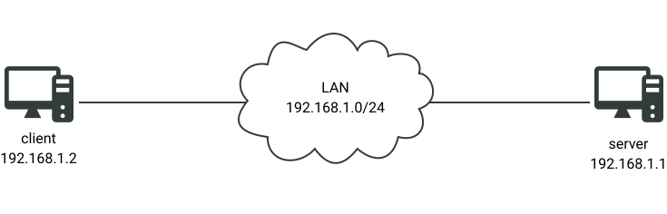
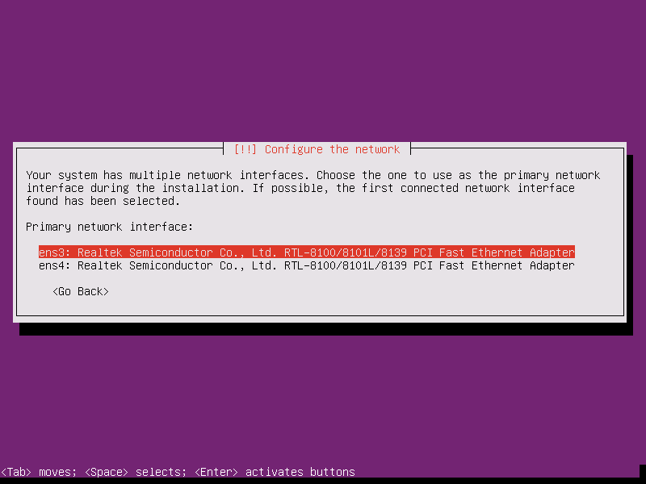
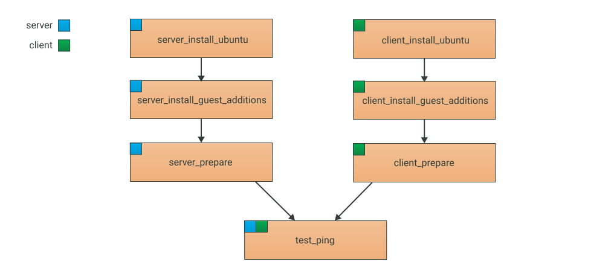

# Tutorial 7. Linking up virtual machines

## What you're going to learn

In this tutorial you're going to learn:

1. How to operate multiple virtual machines in a single test.
2. `plug/unplug nic` actions.
3. Some additional `nic` subattributes.
4. More information about virtual networks.

## Introduction

In the last tutorial we learned about the virtual networks `nat` mode, which allows you to provide the Internet access to virtual machines. But, obviously, virtual networks could (and should) be used for linking up virtual machines with each other as well. That's what we're going to do in this tutorial. Additionally we'll discover a few little tricks to make our test scripts more convenient and easier to read.

At the end of this tutorial we're going to get the following test bench:



## What to begin with?

From this moment on, there will be two virtual machines in our test cases, playing the roles of a server and a client. To make our test scripts more transparent and easier to read, we will need to do some job:

1. Rename the virtual machine `my_ubuntu` into `server`;
2. Rename the params `hostname`, `login`, `password` into `server_hostname`, `server_login` and `default_password` respectively and adjust all the references to these params;
3. Rename the tests `ubuntu_installation` and `guest_additions_installation` into `server_install_ubuntu` and `server_install_guest_additions` respectively;
4. Delete the test `guest_additions_demo`.

You should get the following script:

```testo
network internet {
	mode: "nat"
}

machine server {
	cpus: 1
	ram: 512Mb
	disk main: {
		size: 5Gb
	}
	iso: "\${ISO_DIR}/ubuntu_server.iso"

	nic nat: {
		attached_to: "internet"
	}
}

param server_hostname "server"
param server_login "server-login"
param default_password "1111"

test server_install_ubuntu {
	server {
		start
		wait "English"
		press Enter
		# The actions can be separated with a newline
		# or a semicolon
		wait "Install Ubuntu Server"; press Enter;
		wait "Choose the language";	press Enter
		wait "Select your location"; press Enter
		wait "Detect keyboard layout?";	press Enter
		wait "Country of origin for the keyboard"; press Enter
		wait "Keyboard layout"; press Enter
		#wait "No network interfaces detected" timeout 5m; press Enter
		wait "Hostname:" timeout 5m; press Backspace*36; type "\${server_hostname}"; press Enter
		wait "Full name for the new user"; type "\${server_login}"; press Enter
		wait "Username for your account"; press Enter
		wait "Choose a password for the new user"; type "\${default_password}"; press Enter
		wait "Re-enter password to verify"; type "\${default_password}"; press Enter
		wait "Use weak password?"; press Left, Enter
		wait "Encrypt your home directory?"; press Enter

		#wait "Select your timezone" timeout 2m; press Enter
		wait "Is this time zone correct?" timeout 2m; press Enter
		wait "Partitioning method"; press Enter
		wait "Select disk to partition"; press Enter
		wait "Write the changes to disks and configure LVM?"; press Left, Enter
		wait "Amount of volume group to use for guided partitioning"; press Enter
		wait "Write the changes to disks?"; press Left, Enter
		wait "HTTP proxy information" timeout 3m; press Enter
		wait "How do you want to manage upgrades" timeout 6m; press Enter
		wait "Choose software to install"; press Enter
		wait "Install the GRUB boot loader to the master boot record?" timeout 10m; press Enter
		wait "Installation complete" timeout 1m;

		unplug dvd; press Enter
		wait "server_login:" timeout 2m; type "\${server_login}"; press Enter
		wait "Password:"; type "\${default_password}"; press Enter
		wait "Welcome to Ubuntu"
	}
}

param guest_additions_pkg "testo-guest-additions*"
test server_install_guest_additions: server_install_ubuntu {
	server {
		plug dvd "\${ISO_DIR}/testo-guest-additions.iso"

		type "sudo su"; press Enter;
		# Take a note that you may reference params in any part of the string
		wait "password for \${server_login}"; type "\${default_password}"; press Enter
		wait "root@\${server_hostname}"

		type "mount /dev/cdrom /media"; press Enter
		wait "mounting read-only"; type "dpkg -i /media/\${guest_additions_pkg}"; press Enter;
		wait "Setting up testo-guest-additions"
		type "umount /media"; press Enter;
		# Give a little time for the umount to do its job
		sleep 2s
		unplug dvd
	}
}
```

Since we've renamed our virtual machine into `server`, Testo treats is as a brand new machine, therefore all the tests must run again, including the virtual machine creation.

But we need to keep in mind that the old virtual machine, `my_ubuntu`, **wouldn't go anywhere automatically**. Testo Framework "thinks" that this virtual machine may be of some use for you in the future, and thus shouldn't be removed. Still, we, as humans, understand that we won't need `my_ubuntu` anymore, so let's delete it:


You can see that the virtual network `internet` was deleted as well.

Now, before doing anything else, it's good to make sure we didn't break anything with our changes.


## Declaring the second virtual machine

Now it's time to declare our second virtual machine. As you've probably guessed, it's going to be named `client`, and will be mostly a copy of the `server` machine.

```testo
machine client {
	cpus: 1
	ram: 512Mb
	disk main: {
		size: 5Gb
	}
	iso: "${ISO_DIR}/ubuntu_server.iso"

	nic nat: {
		attached_to: "internet"
	}
}
```

But if we leave our virtual machines as they are now, they won't be connected in any way. To link them up we need to declare a new virtual network:

```testo
network LAN {
	mode: "internal"
}
```

Take a note that this network is declared as `internal`, which means that it's designated to isolated connection between machines.

All that's left to do is to add new NICs to the virtual machines, with attachment to the `LAN` network:

```testo
machine client {
	cpus: 1
	ram: 512Mb
	disk main: {
		size: 5Gb
	}
	iso: "${ISO_DIR}/ubuntu_server.iso"

	nic nat: {
		attached_to: "internet"
	}

	nic server_side: {
		attached_to: "LAN"
		mac: "52:54:00:00:00:AA"
	}
}

machine server {
	cpus: 1
	ram: 512Mb
	disk main: {
		size: 5Gb
	}
	iso: "${ISO_DIR}/ubuntu_server.iso"

	nic nat: {
		attached_to: "internet"
	}

	nic client_side: {
		attached_to: "LAN"
		mac: "52:54:00:00:00:BB"
	}
}
```

You can see that we added the `mac` subattribute to the "internal" NICs. Knowing the exact mac will play its role a little later, when we'll do renaming NICs inside the OS (so we can distinguish them easily).

Of course, the new `client` machine needs a couple of preparatory tests of its own: `client_install_ubuntu` and `client_install_guest_additions`. Don't forget to add a couple of new params:

```testo
param client_hostname "client"
param client_login "client-login"

test client_install_ubuntu {
	client {
		start
		wait "English"
		press Enter
		# The actions can be separated with a newline
		# or a semicolon
		wait "Install Ubuntu Server"; press Enter;
		wait "Choose the language";	press Enter
		wait "Select your location"; press Enter
		wait "Detect keyboard layout?";	press Enter
		wait "Country of origin for the keyboard"; press Enter
		wait "Keyboard layout"; press Enter
		#wait "No network interfaces detected" timeout 5m; press Enter
		wait "Hostname:" timeout 5m; press Backspace*36; type "${client_hostname}"; press Enter
		wait "Full name for the new user"; type "${client_login}"; press Enter
		wait "Username for your account"; press Enter
		wait "Choose a password for the new user"; type "${default_password}"; press Enter
		wait "Re-enter password to verify"; type "${default_password}"; press Enter
		wait "Use weak password?"; press Left, Enter
		wait "Encrypt your home directory?"; press Enter

		#wait "Select your timezone" timeout 2m; press Enter
		wait "Is this time zone correct?" timeout 2m; press Enter
		wait "Partitioning method"; press Enter
		wait "Select disk to partition"; press Enter
		wait "Write the changes to disks and configure LVM?"; press Left, Enter
		wait "Amount of volume group to use for guided partitioning"; press Enter
		wait "Write the changes to disks?"; press Left, Enter
		wait "HTTP proxy information" timeout 3m; press Enter
		wait "How do you want to manage upgrades" timeout 6m; press Enter
		wait "Choose software to install"; press Enter
		wait "Install the GRUB boot loader to the master boot record?" timeout 10m; press Enter
		wait "Installation complete" timeout 1m;

		unplug dvd; press Enter
		wait "${client_hostname} login:" timeout 2m; type "${client_login}"; press Enter
		wait "Password:"; type "${default_password}"; press Enter
		wait "Welcome to Ubuntu"
	}
}

test client_install_guest_additions: client_install_ubuntu {
	client {
		plug dvd "${ISO_DIR}/testo-guest-additions.iso"

		type "sudo su"; press Enter;
		# Take a note that you may reference params in any part of the string
		wait "password for ${client_login}"; type "${default_password}"; press Enter
		wait "root@${client_hostname}"

		type "mount /dev/cdrom /media"; press Enter
		wait "mounting read-only"; type "dpkg -i /media/${guest_additions_pkg}"; press Enter;
		wait "Setting up testo-guest-additions"
		type "umount /media"; press Enter;
		# Give a little time for the umount to do its job
		sleep 2s
		unplug dvd
	}
}
```

We can see a lot of duplicated code, but we shouldn't worry about that. Later we'll learn about macros, which allow to group up frequently-used actions into named blocks, and our sript will get much shorter.

Now let's run our script.


Look at that: Ubunstu installation broke up. Again. Why? Because now we have multiple NICs plugged into the virtual machine, so we get a new screen we haven't been expecting in the test script:



The primary interface is listed at the top, so we just need to press Enter. Let's adjust our test script a little.

```testo
wait "Keyboard layout"; press Enter
#wait "No network interfaces detected" timeout 5m; press Enter
wait "Primary network interface"; press Enter
wait "Hostname:" timeout 5m; press Backspace*36; type "${server_hostname}"; press Enter
```

Run the script again, and now all the tests should pass successfully.

## Unplugging the unused NIC

We've got two virtual machines, which are linked up with the `LAN` network. That's a progress. But before setting up IP-addresses and ping the machines, it would be good to get rid of the `nat` NIC.

In the preparatory tests, when we're doing the most basic setups with the virtual machines, the Internet access is, without any doubt, very important: with the Internet access you can install any missing (for the testing purposes) packages. But later the Internet access becomes just redundant and can potentially mess up our tests (of course, this depends heavily on your test cases, sometimes you need the Internet access all the time, and sometimes you don't need it at all). So let's assume that we want to get rid of the Internet access, and the question is how to do that.

In Testo-lang you have two options with NICs:

1. Plug/unplug the "virtual link" from the NIC ([`plug/unplug link`](../../reference/Actions.md#plug-link)).
2. Plug/unplug the NIC altogether ([`plug/unplug nic`](../../reference/Actions.md#plug-nic)).

You can plug/unplug links at any time (doesn't matter whether the machine is powered on or stopped), but plugging/unplugging NICs is available only when the virtual machine is powered off.

Let's take a look at the `server` machine example. We declare a new test `server_unplug_nat`:

```testo
test server_unplug_nat: server_install_guest_additions {
	server {
		shutdown
		unplug nic nat
		start

		wait "${server_hostname} login:" timeout 2m; type "${server_login}"; press Enter
		wait "Password:"; type "${default_password}"; press Enter
		wait "Welcome to Ubuntu"
	}
}
```

This test begins with stopping the virtual machine. Generally speaking, there are two ways to stop a virtual machine from the outside: the [`stop`](../../reference/Actions.md#stop) action (mimicking power failure) and the [`shutdown`](../../reference/Actions.md#shutdown) action (mimicking pressing the power button on the machine). The `shutdown` action is somewhat more preferable.

When the machine is stopped, we unplug (right from the virtual PCI-express slot) the `nat` NIC and power on our machine again. The test is finished with a successful system login.


After the test is complete, we may open the virtual machine properties (with virtual manager) and make sure that it has only one NIC.

We now duplicate this test for the `client` machine as well.

```testo
test client_unplug_nat: client_install_guest_additions {
	client {
		shutdown
		unplug nic nat
		start

		wait "${client_hostname} login:" timeout 2m; type "${client_login}"; press Enter
		wait "Password:"; type "${default_password}"; press Enter
		wait "Welcome to Ubuntu"
	}
}
```


So we've now got two virtual machines with no redundant NICs and linked them up with the virtual network. We have just one preparatory step left to do.

## Renaming NICs inside the OS

By default, the NICs are given pretty uninformative names inside the OS (`ens3`, `ens4` and so on). Of course it would be much more convenient if we had them named accordingly to their names in the virtual machine declaration: `client_side`, `server_side` and so on. We can actually achieve that with renaming NICs inside the OS based on the MAC, which we already know.

Renaming can be done with (for example), the following bash-script (download link is available at the end of the tutorial).

``` bash
#!/bin/bash

set -e

mac=$1

oldname=`ifconfig -a | grep ${mac,,} | awk '{print $1}'`
newname=$2

echo SUBSYSTEM==\"net\", ACTION==\"add\", ATTR{address}==\"$mac\", NAME=\"$newname\", DRIVERS==\"?*\" >> /lib/udev/rules.d/70-test-tools.rules

rm -f /etc/network/interfaces
echo source /etc/network/interfaces.d/* >> /etc/network/interfaces
echo auto lo >> /etc/network/interfaces
echo iface lo inet loopback >> /etc/network/interfaces

ip link set $oldname down
ip link set $oldname name $newname
ip link set $newname up

echo "Renaming success"
```

Save this script in the `rename_net.sh` file in the same folder where the `hello_world.testo` file is located.

And write a test to use this script inside the `server`:

```testo
test server_prepare: server_unplug_nat {
	server {
		copyto "./rename_net.sh" "/opt/rename_net.sh"
		exec bash """
			chmod +x /opt/rename_net.sh
			/opt/rename_net.sh 52:54:00:00:00:bb client_side
			ip ad
		"""
	}
}
```


In the `ip` command output we can see that the remaining NIC is named clear and neat: `client_side`.

Now we need to setup the IP-address for the NIC:

```testo
test server_prepare: server_unplug_nat {
	server {
		copyto "./rename_net.sh" "/opt/rename_net.sh"
		exec bash """
			chmod +x /opt/rename_net.sh
			/opt/rename_net.sh 52:54:00:00:00:bb client_side
			ip a a 192.168.1.1/24 dev client_side
			ip l s client_side up
			ip ad
		"""
	}
}
```

And repeat all these steps with the `client` virtual machine.

## Pinging!

Finally, all things are set up and we can check that `client` and `server` can ping each other.

Create one last test `test_ping` which, unlike the previous tests, has **two** parent-tests: `client_prepare` and `server_prepare`. We need both these tests to complete successfully to begin the ping testing.

```testo
test test_ping: client_prepare, server_prepare {
	client exec bash "ping 192.168.1.2 -c5"
	server exec bash "ping 192.168.1.1 -c5"
}
```

Final script run


We can see that the ping command runs great, which means that we managed to setup a test bench with two linked up virtual machines!

## Conclusions

Virtual networks can be used not only to gain the Internet access, but to link up virtual machines with each other as well.

Testo Framework allows you to develop preparatory tests with the Internet access and then unplug the NIC leading to the Internet if the Internet is not needed anymore. This way you can reduce the redundant Internet connections, that can possibly mess up the test cases.

You can simplify the NICs distibguishing inside the test scripts by assigning fixed MAC-addresses to the NICs and then renaming them inside the OS to your linking.

Tests hierarchy looks like this at the moment:



See the full test listing [here](ping.testo)
