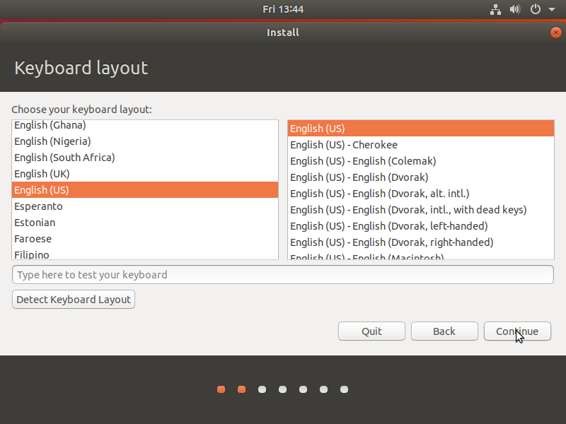
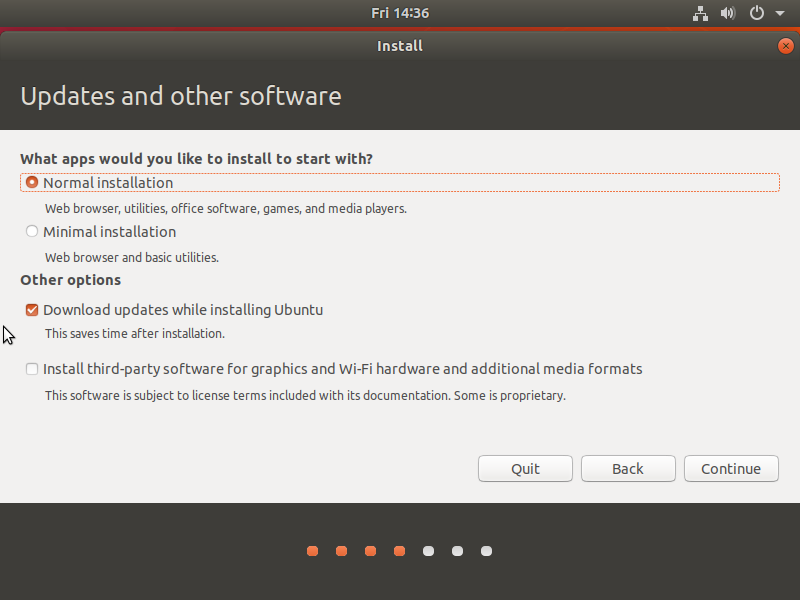
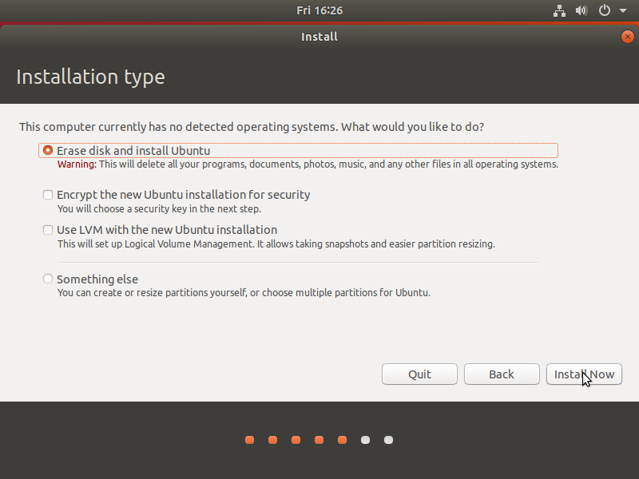
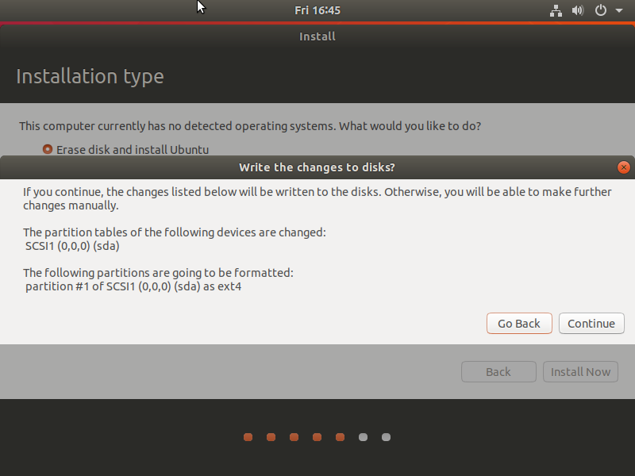
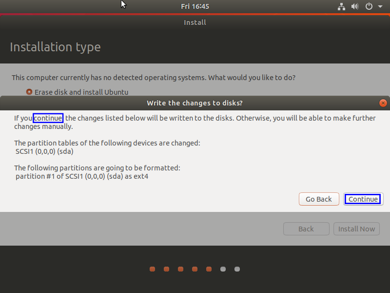
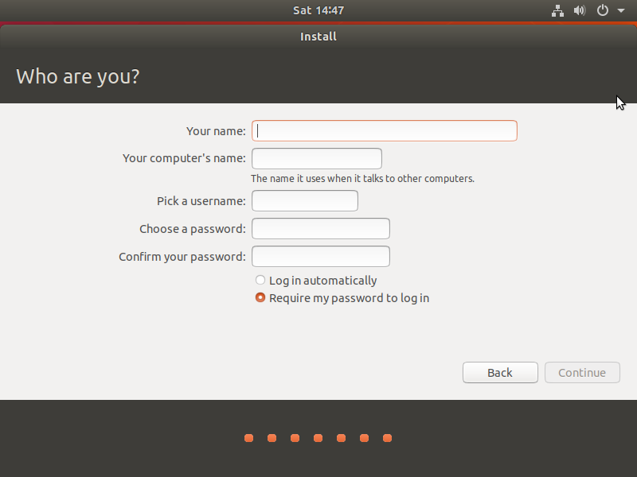
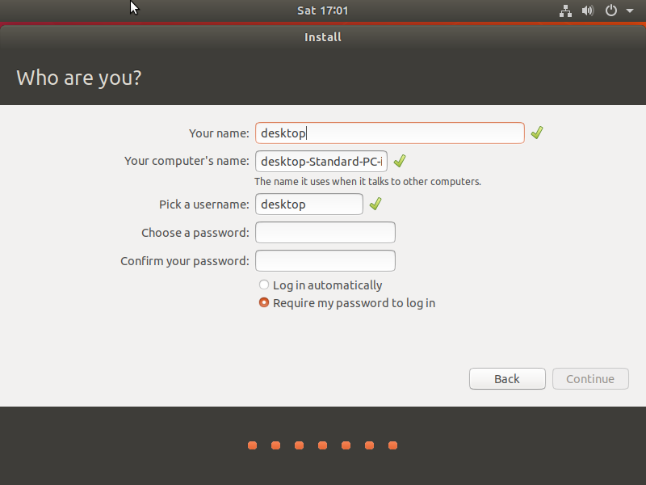
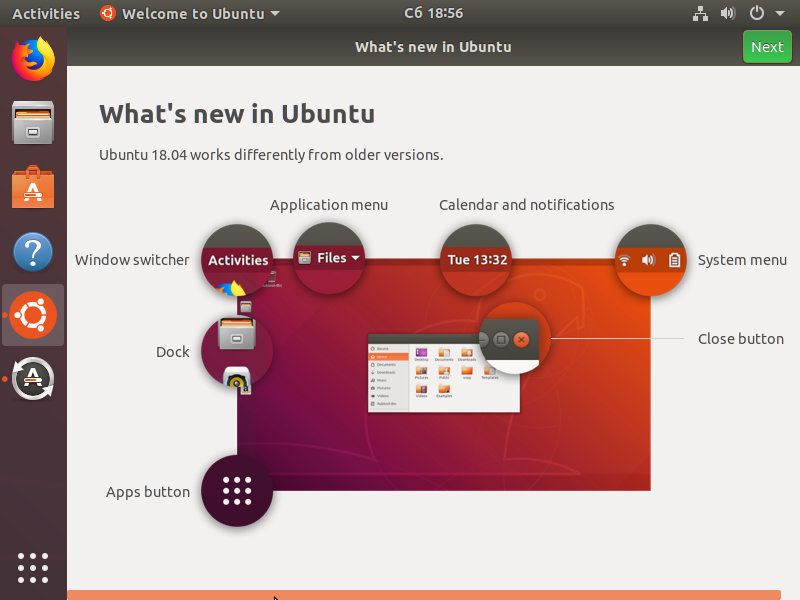

# Tutorial 12. Mouse control

## What you're going to learn

In this tutorial you're going to learn about the mouse control basics in Testo-lang.

## Introduction

With Testo you can control the mouse cursor (when it's available in the virtual machine OS). At first look, this process may seem a little confusing, but as soon as you catch the main [concepts](../../reference/Mouse%20actions.md#a-text-on-the-screen-with-additional-specifiers) of cursor positioning, you won't forget them ever again. It's like bicycle riding - you just need to grasp it once.

To try out the mouse control, we're going to automate the Ubuntu Desktop 18.04 installation. And we're going to do this using the mouse as much as possible.

## What to begin with?

Let's leave alone for now the bench we've been developing for 10 tutorials straight and create a new test script file. We'going to call it `mouse.testo` and it's going to contain all the necessary code for this tutorial (there's not going to be too much code in here, so there's no need to distribute it among several files).

We begin with the already-known basics:

```testo
network internet {
	mode: "nat"
}

machine ubuntu_desktop {
	cpus: 1
	ram: 2Gb
	iso: "${ISO_DIR}/ubuntu_desktop.iso"

	disk main: {
		size: 10Gb
	}

	nic internet: {
		attached_to: "internet"
		adapter_type: "e1000"
	}
}

param login "desktop"
param hostname "desktop-PC"
param password "1111"

test install_ubuntu {
	ubuntu_desktop {
		start
		abort "stop here"
	}
}
```

We're creating a new virtual machine named `ubuntu_desktop`. Because of the GUI, it needs a little more RAM than the `ubuntu_server` machine from the previous tutorials. It also needs more disk space (10 Gigabytes should be enough). We declare beforehand some already known params: `login`, `hostname`, `password` and proceed straight to the installation automation.

The first two screens doesn't have any GUI-contents, so we process them as usual, the routine is self-explanatory. To get to the first GUI screen we'll need the following script:

```testo
test install_ubuntu {
	ubuntu_desktop {
		start
		wait "English"
		press Enter
		wait "Try Ubuntu without installing"; press Down, Enter
		wait "Welcome" timeout 5m
		abort "stop here"
	}
}
```


We're going to see this screen:


> Keep in mind that sometimes the Ubuntu Desktop installation starts another way: the first screen we're seeing already has the GUI and prompt us to select `Try Ubuntu` or `Install Ubuntu`. Try to apply your knowledge from the previous tutorials and modify the script so it would work in both cases.

Obviously, to continue the installation we need to press the `Continue` button. We're going to use the mouse cursor to do this. And we're going to control the cursor with the [`mouse click`](../../references/Mouse%20actions.md#mouse-clicklckick-rclick-dclick)).

```testo
test install_ubuntu {
	ubuntu_desktop {
		start
		wait "English"
		press Enter
		wait "Try Ubuntu without installing"; press Down, Enter
		wait "Welcome" timeout 5m
		mouse click "Continue"
		abort "stop here"
	}
}
```

The `mouse cick "Continue"` action means the following: "Wait for the `Continue` text to show up on the screen (the default timeout is 1 minute), move the mouse cursor at the center of this text and do a left click".

Since the `Continue` text had already showed up by the time we invoked this action, the `mouse click` had worked instantly, without any actual waiting.

Looks not so hard, doesn't it? Most times your mouse control actions will look just like this: easy and straightforward. But don't be mistaken: the `mouse` actions in Testo-lang are very powerful and have a lot of features, allowing you to do some really complex moves. That's what we're going to learn pretty soon.

So we move on to the next screen:



Let's focus on a very interesting moment. As we've mentioined before, the `mouse click "Continue"` aciton means moving the cursor to the center of the `Continue` text. So the action worked as planned, the button has been pressed and now at the next screen we need to do just the same thing: press the "Continue" button. So let's do it, shall we?

```testo
test install_ubuntu {
	ubuntu_desktop {
		start
		wait "English"
		press Enter
		wait "Try Ubuntu without installing"; press Down, Enter
		wait "Welcome" timeout 5m
		mouse click "Continue"
		wait "Keyboard layout"
		mouse click "Continue"
		abort "stop here"
	}
}
```

But the thing is, the second `mouse click "Continue"` action might not work! The reason is that the mouse cursor image **itself** is partially blockng the `Continue` text inside the button, so Testo Framework might not detect it! After waiting with no success for 1 minute for the `Continue` text to appear, an error would be generated. There are several ways to get the cursor out of the way, and we're going to learn two of them.

## Positioning the cursor inside the text instance

So our goal is the following: on the `Welcome` screen we need to click the `Continue` button in such a manner that the cursor image doesn't block the `Continue` text on the next screen `Keyboard layout`. To achieve this goal we'd need a [specifier](../../references/Mouse%20actions.md#a-text-on-the-screen-with-additional-specifiers) for positioning the cursor inside the text instance.

By default, the `mouse click "Continue"` action moves the cursor at the center of the `Continue` text. But to make the `Continue` text visible in the next screen, we need to move the cursor not at the center, but somewhere where it wouldn't stay in the way. To do that we could apply (for example) the `center_bottom` specifier, which would move the cursor at the center of the bottom edge of the text. The usage looks like this:

```testo
test install_ubuntu {
	ubuntu_desktop {
		start
		wait "English"
		press Enter
		wait "Try Ubuntu without installing"; press Down, Enter
		wait "Welcome" timeout 5m
		mouse click "Continue".center_bottom()
		wait "Keyboard layout"
		abort "stop here"
	}
}
```

Now the `Keyboard layout` screen looks like this:


As we can see, now the cursor doesn't block the `Continue` text, and we can easily detect ahd click the button again:

```testo
test install_ubuntu {
	ubuntu_desktop {
		start
		wait "English"
		press Enter
		wait "Try Ubuntu without installing"; press Down, Enter
		wait "Welcome" timeout 5m
		mouse click "Continue".center_bottom()
		wait "Keyboard layout"
		mouse click "Continue".center_bottom()
		abort "stop here"
	}
}
```

On the next screen:



We're going to select the minimal installation and disable the updates:

```testo
wait "Updates and other software"
mouse click "Minimal installation"
mouse click "Download updates while installing"; mouse click "Continue"
```

Take a note, that we deliberately clicked on the `Continue` center so the cursor image would block up the `Continue` text on the next screen. We did so to demonstrate another way to move the mouse cursor away so it wouldn't block the view.

## Moving the cursor using coordinates

So we're on the installation type selection screen, and the cursor, once again, has blocked the text we want to click on.



This time we're going to move the cursor aside using the absolute coordinates:

```testo
mouse click "Download updates while installing";
mouse click "Continue"
wait "Installation type";
mouse move 0 0;
mouse click "Install Now".center_bottom()
```

We used a new action `mouse move`, which works exactly the same as the `mouse click`, but doesn't do a click. You can move the cursor based both on object detection (`mouse move "Continue"` and so on) and on absolute [coordinates](../../references/Mouse%20actions.md#coordinates).

Coordinates in the upper left corner of the screen are equal to X: 0 and Y: 0. To move the cursor to a right or a bottom corner of the screen you'd need to know the current screen resolution. For example, if the screen resolution was 800x600, then the bottom right corner coordinates would be X:799 and Y:599. The behaviour is undefined if you try to push the cursor beyond the screen limits.

Therefore, the `mouse move 0 0` action basically means "Move the cursor to the upper left screen corner so it won't stay in the way".

## Selecting the text instance

The next screen we see:



We need to click the `Continue` button once again. But if we try to do so as we're used to:

```testo
mouse click "Download updates while installing"; mouse click "Continue"
wait "Installation type"; mouse move 0 0; mouse click "Install Now".center_bottom()
wait "Write the changes to disks?";
mouse click "Continue".center_bottom()
```

We'll see, it leads to an error:


So what's the deal? The deal is that there're two `Continue` text instances on the screen:



> Despite that the one `Continue` text instance starts with the capital "C" and the other - with the small "c", the detection engine sometimes could think that they are the same text (even though the engine is case-sensitive). This happens sometimes, no need to worry.

So what's the problem, why we can't apply the `center_bottom` specifier? When there're several instances of the text we want to click (or just the move the cursor at), Testo Framework can't be sure which text instance we have in mind. Therefore, Testo doesn't know how to apply the `center_bottom` specifier (which we can see in the error message).

To fix this error, we need to specify the text instance we want to click. It's also done with special specifiers, there're 4 of them: `from_left()`, `from_right()`, `from_top()` and `from_bottom()`. In this case we're going to use the `from_bottom()` specifier:

```testo
mouse click "Download updates while installing"; mouse click "Continue"
wait "Installation type"; mouse move 0 0; mouse click "Install Now".center_bottom()
wait "Write the changes to disks?";
mouse click "Continue".from_bottom(0).center_bottom()
```
So what do we imply with such an action? Something like this:

1. Find all the `Continue` text instances on the screen (if there's no instances, wait for at least one to appear, but no longer than 1 minute);
2. From the found instances pick the one closest to the bottom edge of the screen;
3. Apply the `center_bottom` specifier and move the cursor to the center of the bottom edge of the picked instance;
4. Perform the left-click.

Previously, when the screen had only one instance of the expected text, this step could have been omitted, but this time we need it. If we'd wanted to click the upper `Continue` instance, we'd have used the `from_bottom(1)` specifier or the `from_top(0)` specifier. Of course, if we'd tried to access the `from_top(2)` instance we'd gotten an error, since it would have been basically a try to access an out-of-boundary array element.

## Final cursor positioning

Sooner than later we're going to see the screen with the login and password prompts.



Of course, we could've entered all the values using the keyboard only (we can switch the current input field with a `press Tab` action), but for educational purposes we'ge going to do this with the mouse.

For starters, we're going to click the `Your name` input field. This input is selected by default but we're going to pretend we don't know about it.

To achieve this, we're going to use an additional mouse `move` specifier - another way to adjust the cursor position in Testo-lang:

```testo
wait "Where are you?"; mouse click "Continue".center_bottom()
wait "Who are you?";
mouse click "Your name:".right_center().move_right(20);
type "${login}"
```

The positioning logic is this:

1. Find a "starting point" - some object on the screen from where we can begin the search for the input field. In this case, the `Your name:` text is a perfect candidate for that. Since it's the only `Your name` text on the screen, we can omit the `from` specifier.
2. Now we have to position the cursor inside the `Your name` text. Since the field we are after is placed at the right side of the `Your name` text, it is reasonable to move the cursor to the right edge of the text using the `right_center` specifier.
3. But it's still not enough - the cursor is not where we want it to be. To finally place the cursor at the desired destination, we need to move the mouse to the right for some number of pixels. We may roughly estimate that 20 pixels should be more than enough, and add the `move_right(20)` specifier. Now we can do the left-click.
4. The desired input field is selected, we may type our login.

> You may omit the `right_center` specifier and write `mouse click "Your name:".move_right(20)`, but in this case we would've needed to count the pixels starting from the `Your name`'s' center, which is not very convenient.

> You don't have to stop after the `.move_right(20)` specifier - you can move the cursor further in any direction as many times as you like. For example, `mouse click "Your name:".move_right(20).move_down(50).move_left(10).move_left(30)` and so on.

When the login is typed, the generated hostname appears and it look absolutely terrifying. We definetely don't want to leave it like this:



We're going to fix this the same way:

```testo
wait "Where are you?"; mouse click "Continue".center_bottom()
wait "Who are you?";
mouse click "Your name:".right_center().move_right(20); type "${login}"
mouse click "Your computer's name".right_center().move_right(20);
press LeftCtrl + A, Delete; type "${hostname}"
```

Take a note, that to erase the generated hostname, first we need to select all the text by pressing CTRL+A.

Then we're going to aim for the `Password` word to enter the password value. To do that we need to apply all the three kinds of specifiers at the same time:

```testo
mouse click "Your computer's name".right_center().move_right(20); press LeftCtrl + A, Delete;  type "${hostname}"
mouse click "password:".from_top(0).right_center().move_right(20); type "${password}"
mouse click "password:".from_top(1).right_center().move_right(20); type "${password}"
```

Congratulations! You've learned the basics for the mouse control in Testo-lang! Let's summarize everything we've learned:

1. First you need to find the text instance you want to move the cursor at. You can do it with the `from` specifiers, counting the instances starting with the screen sides. If the desired text has only one instance on the screen, you may skip this step.
2. Position the cursor inside the selected text instance. If you're OK with the positioning at the center, you may skip this step.
3. Move the cursor for some pixels to the right, left, up or down from the point obtained at step 2. This step may be skipped if you're OK with the step 2 results.

## Completing the installation

We're moving on to the "Restart now" screen. We can do a little trick and save us some space in the script: if you need to wait a text and then click it (or just use somehow in a `mouse` action), then you may just omit the `wait` action.

For example, the following code:

```testo
mouse click "password:".from_top(1).right_center().move_right(20); type "${password}"
mouse click "Continue".center_bottom()
wait "Restart now" timeout 10m; mouse click "Restart Now"
```

Is totally equal to the next code:

```testo
mouse click "password:".from_top(1).right_center().move_right(20); type "${password}"
mouse click "Continue".center_bottom()
mouse click "Restart Now" timeout 10m
```

The `mouse click` action encapsulates both the waiting for the text to appear and the reaction to this appearance. If the waiting part fails (timeout is triggered), then the whole action fails, just like a `wait` action would.

Keep in mind, that unlike in the Ubuntu Server installation, we shouldn't unplug the installation media when the "Installation complete" screen shows up (this leads to the virtual machine freezing up). So we just need to reboot the machine, wait the following screen to appear and only then remove the media:


To trigger the reboot process we can just press Enter, or use the `stop, start` combination.

```testo
mouse click "Restart Now" timeout 10m
wait "Please remove the installation medium" timeout 2m;
unplug dvd; stop; start
```

Finally, we need to login into the freshly installed OS to make sure that everything is OK. The login screen looks like this:


To wait for the login screen we could've have used the `wait "${login}"` action. But we've chosen the `desktop` as the login, and there is a chance that the `desktop` text could appear on the screen during the OS boot, before the login screen shows up. To ensure that the `wait` action doesn't trigger false-positively before needed, we're going to make the select expression more specific like this: `wait "${login} && "Not listed?"`. This `wait` triggers only when both `${login}` and `Not listed` are on the screen at the same time, which can't occur during the OS boot.

And so, the final actions for the Ubuntu Desktop installation are the following:

```testo
unplug dvd; stop; start
wait "${login}" && "Not listed?" timeout 3m

mouse click "${login}";
wait "Password"; type "${password}"; mouse click "Sign In"
wait "Welcome to Ubuntu"
```

The Ubuntu Desktop installation is finally complete, but there are a few moments left for us to learn about.

## More mouse control examples

To exercise the mouse control a little bit more, let's develop a test in which we're going to create a folder and then move it to the Trash bin.

First let's get rid of this obtrusive screen:



```testo
test mouse_demo: install_ubuntu {
	ubuntu_desktop {
		mouse click "Welcome to Ubuntu"
		mouse click "Quit"
		abort "stop here"
	}
}
```

Take a note, that we didn't put an additional `wait` aciton to wait for the `Quit` text to appear. Instead we used the `mouse click` action feature of waiting the object (default timeout is 1 minute) before clicking it.

Now we're going to create a new folder:

```testo
test mouse_demo: install_ubuntu {
	ubuntu_desktop {
		mouse click "Welcome to Ubuntu"
		mouse click "Quit"

		mouse rclick 400 300
		mouse click "New Folder"
		wait "Folder name"; type "My folder"; mouse click "Create"
		wait "My folder" && !"Create"

		abort "stop here"
	}
}
```

As we all know, to create a folder we need to do a right-click on the desktop empty space. To do a right-click we have to use the `mouse rclick` aciton, and to specify the click destination we just use some coordinates "somewhere on the desktop" (our current screen resolution is 1024x768). After that, we make sure that the folder is indeed created (the `My folder` text is present, but the `Create` text is absent).


Now we want to remove the folder and move it to the Trash bin. We're going to do so like this:

1. Move the mouse cursor at the `My folder` text.
2. Hold down the left mouse button.
3. Move the cursor someplace else on the Desktop.
4. Move the cursor to the `Trash` text.
5. Release the left mouse button.
6. Make sure that the `My folder` text is gone.

The 3rd step is somewhat questionable: why would we need to move the folder somewhere else before placing it into the Trash bin? As a matter of fact, for some mysterious reason, the GUI won't work as planned if the 3rd step is skipped. No, really, try this out and see for youself. Maybe there is a bug hidden there or something.

```testo
#Move the folder to trash
mouse move "My folder";
mouse hold lbtn
mouse move 200 300
mouse move "Trash"
mouse release

wait !"My folder"
```

Take a closer look to the `mouse hold` and `mouse release` actions. The `mouse hold` action, as you've guessed, holds down a mouse button, and the `mouse release` action releases all the currently held down buttons. There are, however, some restrictions to these actions:

1. You can't hold down more than one button at a time.
2. You must release all held down buttons before the end of the test.
3. You can't click anything if any of your mouse buttons is held.

And the final task in this tutorial: empty the Trash bin. The solution script is self-explanatory:

```testo
#Empty trash
mouse move 0 0 #move cursor aside
mouse dclick "Trash"
#Check if our folder actually is in the trash
wait "My folder"
mouse click "Empty"
mouse click "Empty Trash"
mouse move 0 0
wait "Trash is Empty"
```

Take a look at the `mouse dclick` action - the convenient way to perform a double left click on the mouse. You can also see, that we had to add the `mouse move 0 0` actions a couple of times to move the cursor away, so it wouldn't stay in the way blocking the text. The rest is pretty much straightforward.

## Conclusions

Mouse control in Testo-lang is done with the `mouse` actions. The `mouse` actions are designed in such a way that the simple controls would look short and easy, but if you had to add some complexity to your clicks and movements, you could do it in the most convenient manner. Try to practise a little, and you'll find that it's not that hard.
