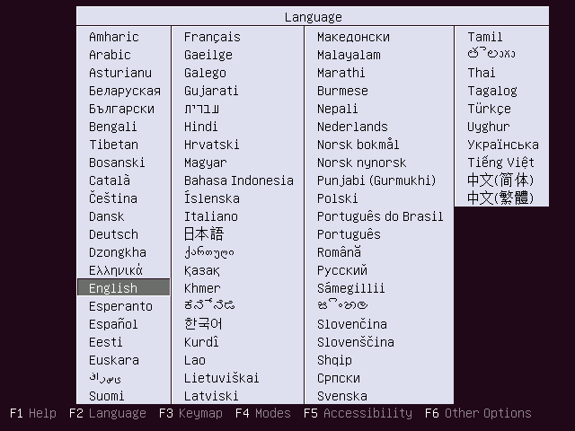
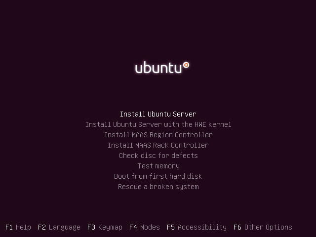
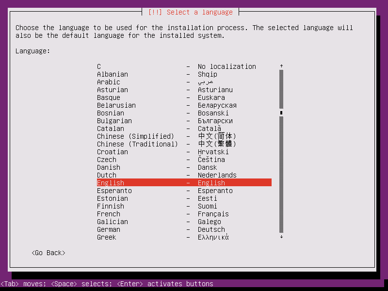
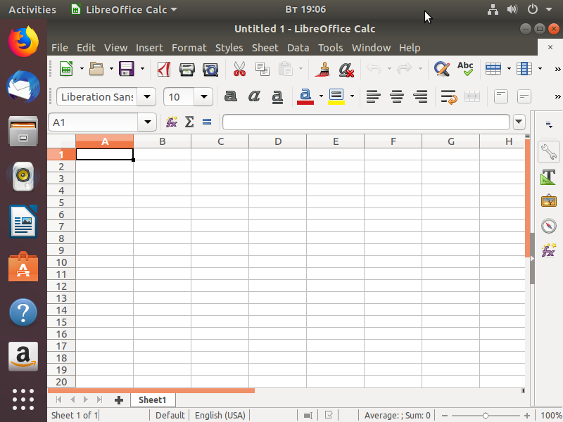
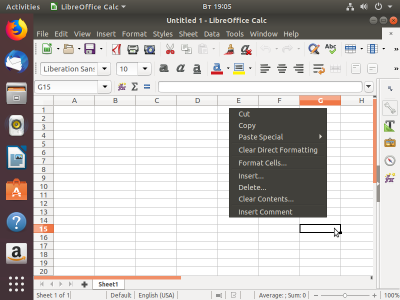

# Tutorial 14. JS-selectors

## What you're going to learn

In this tutorial you're going to learn the basic concepts of JS-selectors in Testo-lang, including:

1. How to do not obvious and really complex checks of screen contents in the `wait` actions and `check` expressions using JS-selectors.
2. How to place the mouse cursor on the screen using JS-selectors if the specifiers are not enough for you.

## Introduction

In the previous tutorials we've learned the `wait`, `check` and `mouse` basics. As you could've noticed, most times these actions look simple and short, but at the same time, if needed, they could easily be expanded to perform a relatively complex logic. For instance, if you had to detect the simultaneous presence of several textlines on the screen, you might use a `wait` action with the `&&` operator. Or, if you had to move the mouse cursor 50 pixels to the right of a text, you might use the `right_center` and `move_right(50)` specifiers.

But if the built-in Testo-lang syntax constructs are not enough for you? How to check, that there are exactly 3 instances of a textline on the screen? How to move the cursor based not on one, but on two or more objects on the screen? The examples are endless, and of course sometimes you'd feel that Testo-lang built-in possibilities somehow can't deliver you the flexibility you want to get.

Well, in this quite rare cases you still have the one last tool to use: [JS-selectors](../../reference/Javascript%20selectors.md). What are JS-selectors? Basically, a JS-selector is a little piece of javascript code (a snippet) which can be placed in a `wait`, `check` or `mouse` actions. Inside these snippets you can get the information about the objects on the screen (via global built-in fuctions) and then implement whatever logic you want. The javascript result determines the outcome of the action (or the expression) in which it is used. And this is what we're going to learn about in this tutorial.

## What to begin with?

Let's move back to the ubuntu Server installation, to which we've payed so much time already (and seemingly took to the perfection). Just look at the first screen one more time:



As we remember, we need to press Enter when this screen shows up, since we're OK with the English language. But really, how exactly can we be sure that the default language choice is English? What if we're the Ubuntu Srever developers and we want to make sure that in the current Ubuntu build the default language is English indeed? What if this default selection works now, but in 10 commits some newbie breaks something and the default language selection becomes French somehow? Of course we don't want this to happen!

The question is: is there a way to make sure that the default selected language is, indeed, English? It is not enough to detect the English language on the screen, we need make sure it is **seleceted**. Well, there is a way. A JS-selector is the way.

To think of it, how do you even formalize the statement "The text is selected"? Well, it might be done if you consider colors. Take a look at the screenshot. We can notice that the selected text differs from any other text with the colors: the text color is white and the background color is gray. Other not-selected languages have black letters on somewhat white background.

And we're going to detect such a color combination using our first JS-selector:

```testo
macro install_ubuntu(hostname, login, password = "${default_password}") {
	start
	wait js "return find_text('English').match_color('white', 'gray').size() == 1"
	press Enter
	...
```

So what do we see? First, we used a new `wait` format: `wait js`. This means that we want to detect not a simple text (or a text combination), but a JS-selector result. What's the difference? `wait "Text"` triggers when there is at least one instance of "Text" on the screen. `wait js` triggers when the javascript-code inside the JS-selector returns `true`. If the JS-selector doesn't return the `true` value in the specified timeout, then the `wait` action fails with an error.

The javascript-code itself must be encapsulated in quotes (if the snippet is long enough you may use the multiline strings with triple quotes, which you'll see in action a bit later). All we need to do is to create a snippet that returns `true` when, first, the "English" text may be found on the screen, and second, this text is white on the gray background. To do this we're using the built-in javascript global functions:
1. First we call the [`find_text`](../../reference/Javascript%20selectors.md#find_imgpath_to_template) with the "English" argument, which returns us the `TextTensor` object containing the information about all the detected "English" textlines on the screen.
2. Now we have the `TextTensor` object containing the "English" text instances (we have only one such instance on this screen). We need to get the text color and the background color. We can do this with the [`match_color`](../../reference/Javascript%20selectors.md#match_colorforeground_color-background_color) method. The foreground color we want to match is `white` and the background is `gray`.
3. If after all our matches we get the `TextTensor` object with one text instance in it (we could check it with the `size()` method) this'll mean that we actually have the "English" text on the screen and it is, indeed, selected. When this happens, we just return `true` and the control will move on to the next action. In other cases we return `false`, which will force Testo to check the screen one more time a bit later.

Also you should keep in mind that you can combine both JS-selectors and regular text specifiers in a single `wait` action. For instance, we could've hardened up the detection a little bit more and add one more check to the `wait` action, something like this:

```testo
macro install_ubuntu(hostname, login, password = "${default_password}") {
	start
	wait "Language" && js "return find_text('English').match_color('white', 'gray').size() == 1"
	press Enter
	...
```

Such a `wait` triggers only when both the `Language` text and **selected** `English` text are on the screen.

Try to run the Ubuntu Server installation test with the new `install_ubuntu` macro and make sure that it goes successfully past the Language selection screen. Try also to change the language in the JS-selector from `English` to, for instance, `French`, and make sure that the `wait` fails, because the `French` isn't selected by default.

Let's move on to the next screen:



This time we can see that the selected text can be distinguished only by the text color itself, the background color is the same for all the texts. So this time our JS-selector is going to be a little shorter:

```testo
macro install_ubuntu(hostname, login, password = "${default_password}") {
	start
	wait js "return find_text('English').match_color('white', 'gray').size() == 1"
	press Enter
	wait js "find_text('Install Ubuntu Server').match_foreground('white').size() == 1"; press Enter;
	...
```

## Hardening up the Ubuntu Server installation waits

Next we're going to see another language selection screen:



Here (and further on) the text selection criteria is the white letters on the red background. So basically every time we want to make sure that some text is selected and we're pressing the "button" we actually expect to press, we need to do something like this:

```testo
wait "Choose the language" && js "return find_text('English').match_color('white', 'red').size() == 1"; press Enter
...
```

Pretty cumbersome, isn't it? And this kind of checks are going to participate in almost each line of our test script.

But we can smart things up a bit and encapsulate the JS-logic into a macro:

```testo
macro enter_if_selected(text) {
	if (check js "return find_text('${text}').match_color('white', 'red').size() > 0") {
		press Enter
	} else {
		abort "String ${text} is not selected!"
	}
}
```

This macro checks if the text is selected, and if it is - presses the Enter key afterwards. If the text is not selected - the macro generates an error.

Now these selection checks look much neater:

```testo
wait "Choose the language";	enter_if_selected("English")
...
```

The whole `install_ubuntu` macro is going to look like this:

```testo
macro install_ubuntu(hostname, login, password = "${default_password}") {
	start
	wait js "return find_text('English').match_color('white', 'gray').size() == 1"
	press Enter
	wait js "return find_text('Install Ubuntu Server').match_foreground('white').size() == 1"; press Enter;
	wait "Choose the language";	enter_if_selected("English")
	wait "Select your location"; enter_if_selected("United States")
	wait "Detect keyboard layout?";	enter_if_selected("No")
	wait "Country of origin for the keyboard"; enter_if_selected("English (US)")
	wait "Keyboard layout"; enter_if_selected("English (US)")
	wait "No network interfaces detected" || "Primary network interface" || "Hostname:" timeout 5m
	if (check "No network interfaces detected") {
		enter_if_selected("Continue")
	} else if (check "Primary network interface"){
		enter_if_selected("ens3")
	}
	wait "Hostname:" timeout 5m; press Backspace*36; type "${hostname}"; press Tab; enter_if_selected("Continue")
	wait "Full name for the new user"; type "${login}"; press Tab; enter_if_selected("Continue")
	wait "Username for your account"; press Tab; enter_if_selected("Continue")
	wait "Choose a password for the new user"; type "${password}"; press Tab*2; enter_if_selected("Continue")
	wait "Re-enter password to verify"; type "${password}"; press Tab*2; enter_if_selected("Continue")
	if (check "Use weak password" timeout 3s) {
		press Left; enter_if_selected("Yes")
	}
	wait "Encrypt your home directory?"; enter_if_selected("No")
	wait "Select your time zone" || "Is this time zone correct?" timeout 2m;
	if (check "Select your time zone") {
		enter_if_selected("Eastern")
	} else {
		enter_if_selected("Yes")
	}
	wait "Partitioning method"; enter_if_selected("Guided - use entire disk and set up LVM")
	wait "Select disk to partition"; enter_if_selected("SCSI1")
	wait "Write the changes to disks and configure LVM?"; press Left; enter_if_selected("Yes")
	wait "Amount of volume group to use for guided partitioning"; press Tab; enter_if_selected("Continue")
	wait "Write the changes to disks?"; press Left; enter_if_selected("Yes")
	wait "HTTP proxy information" timeout 3m;

	if (DEFINED HTTP_PROXY) {
		type "${HTTP_PROXY}"
	}

	press Tab; enter_if_selected("Continue")
	wait "How do you want to manage upgrades" timeout 6m; enter_if_selected("No automatic updates")
	wait "Choose software to install"; press Tab; enter_if_selected("Continue")
	wait "Install the GRUB boot loader to the master boot record?" timeout 10m; enter_if_selected("Yes")
	wait "Installation complete" timeout 1m;

	unplug dvd; enter_if_selected("Continue")
	wait "${hostname} login:" timeout 2m; type "${login}"; press Enter
	wait "Password:"; type "${password}"; press Enter
	wait "Welcome to Ubuntu"
}
```

As we can see, the macro didn't get much larger or more cumbersome, but instead we've got two huge benefits:
1. At each screen we make sure that we select the exact menu entry we expect to select. This brings the checking capabilities of the macro to a whole new level.
2. Now a simple glance at the macro body is enough to understand precisely what's going on and what entries are selected. The `press Enter` actions we used before were pretty meaningless, but now we get a macro which is mush easier to read and support.

And so with one new macro and a JS-selector we've managed to improve the already good and well-written ubuntu installation process.

## Moving the mouse cursor with JS-selectors

Earlier in this tutorial we've learned about the JS-selectors in the `wait` actions and `check` expressions. But aside from that, you may also use JS-selectors to specify the coordinates to move the mouse cursor to, if for some reason the built-in Testo-lang specifiers are not enough. To demonstrate that, let's assume that want to test out the interaction with cells in LibreOffice Calc. We're going to use the [Tutorial 12](../12%20-%20mouse) results, where we automated the Ubuntu Desktop 18.04 installation.

Let's do a little organizing and get everything in order:
1. Move the `ubuntu_desktop` virtual machine declaration to the `declarations.testo` files which we've got at the end of [tutorial 11](../11%20-%20no_snapshots).
2. Rename the `login` and `hostname` params from the tutorial 12 into `desktop_login` and `desktop_hostname` correspondingly, and then move them to the `declarations.testo` as well.
3. Rename the `install_ubuntu` test from the tutorial 12 into `instal_ubuntu_desktop` and then move it to the `tests.testo` from the tutorial 11.
4. Remove the action `mouse click "Minimal installation"` from the `install_ubuntu_desktop` so LibreOffice would be installed.
5. Don't move the `mouse_demo` test, we're not going to need it.

When this is done, run the `install_ubuntu_desktop` test and make sure it passes successfully.

```testo
test install_ubuntu_desktop {
	ubuntu_desktop {
		start
		wait "English"
		press Enter
		wait "Try Ubuntu without installing"; press Down, Enter
		wait "Welcome" timeout 5m
		mouse click "Continue".center_bottom()
		wait "Keyboard layout"
		mouse click "Continue".center_bottom()
		wait "Updates and other software"
		mouse click "Download updates while installing"; mouse click "Continue"
		wait "Installation type"; mouse move 0 0; mouse click "Install Now".center_bottom()
		wait "Write the changes to disks?"; mouse click "Continue".from_bottom(0).center_bottom()
		wait "Where are you?"; mouse click "Continue".center_bottom()
		wait "Who are you?";

		mouse click "Your name".right_center().move_right(20); type "${desktop_login}"
		mouse click "Your computer's name".right_center().move_right(20); press LeftCtrl + A, Delete;  type "${desktop_hostname}"
		mouse click "password:".from_top(0).right_center().move_right(20); type "${default_password}"
		mouse click "password:".from_top(1).right_center().move_right(20); type "${default_password}"
		mouse click "Continue".center_bottom()
		mouse click "Restart Now" timeout 15m
		wait "Please remove the installation medium" timeout 2m;
		unplug dvd; stop; start
		wait "${desktop_login}" && "Not listed?" timeout 3m

		mouse click "${desktop_login}";
		wait "Password"; type "${default_password}"; mouse click "Sign In"
		wait "Welcome to Ubuntu"
	}
}
```


Let's create a new test in which we're going to launch the LibreOffice Calc:

```testo
test libre_office_launch: install_ubuntu_desktop {
	ubuntu_desktop {
		mouse click "Welcome to Ubuntu"
		mouse click "Quit"
		wait !"Welcome to Ubuntu"
		mouse click "Activities"
		wait "Type to search"; type "libre"
		mouse click "LibreOffice Calc"
		wait "Untitled 1 - LibreOffice Calc"
	}
}
```

At the end of this test we're going to see the next screen:



And now one more test in which we're going to actually demonstrate the JS-selectors in `mouse` actions:

```testo
test libre_office_demo: libre_office_launch {
	ubuntu_desktop {
		abort "stop here"
	}
}
```

So let's take a little break and think about it. What if for some reason we want to click a particular cell when working with LibreOffice Calc? You can't solve this with the mouse specifiers (at least not in an obvious way). Yes, we could've estimated the pixels number from some text on the screen to the cell we want to click, but's tedious and ineffective. We'll go another way.

Let's assume that we want to right-click the `B15` cell.

To do that we're going to use a JS-selector:

```testo
test libre_office_demo: libre_office_launch {
	ubuntu_desktop {
		mouse rclick js """
			row_index = find_text('15').from_left(0).center()
			column_index = find_text('B').from_right(0).center()

			return {x: column_index.x, y: row_index.y}
		"""

		wait "B15"
	}
}
```

Let's sort things out.

The first thing we see is the `mouse rclick js` action, which means that we want to perform the right-click at the coordinates returned by the JS-selector. Keep in mind, that we may use only **one** JS-selector per `mouse` action (as opposed to `wait` and `check` where you can combine as many JS-selectors as you like). If you decide to use a JS-selector in a `mouse` - then you shpuld not use the regular "text with specifiers" in the same action.

So how does a JS-selector work in a `mouse` action? In a `wait` or a `check` the JS-selector must return `true` or `false`, but in a `mouse` action the JS-selector must return **an object with the `x` and `y` properties**. This object represents the point at the screen to which you want to move the mouse cursor. The `x` and `y` properties must be non-negative integers.

With this new information let's explain the logic concealed in the JS-selector:
1. We need to get the center coordinates of the "15" text - the row number of the cell we're interested in. To get the coordinates first we need to get all the "15" text instances as we've done it before (with "English" text), and then we get the most left detected instance using the [`from_left()`](../../reference/Javascript%20selectors.md#from_leftindex) method of the `TextTensor` class. But that's not all: since we need not the text "15" itself but the coordinates of the center, we need to call the [`center()`](../../reference/Javascript%20selectors.md#center) method, which returns the [`Point`](../../reference/Javascript%20selectors.md#class-point) with the coordinates we want to get.
2. Then the process is repeated to get the "B" text center coordinates.
3. We want to return a point which has the X coordinate from the "B" and the Y coordinate from the "15" (which is the intersection point of the 15th row and the "Gth" column). To do that we create the `result` object with two propetries: `x` and `y` and fill them accordingly. This object is returned to the outside.

Let's run the test and see what's going to happen:



We can see that the test went just as we planned.

## Conclusions

Despite that most times the built-in Testo-lang constructs are more than enough to check the screen or move the mouse cursor in any way you want, sometimes you may encounter particularly complex and elaborate conditions in which the standard Testo-lang tools might fail. In these rare cases you should use JS-selectors, with which you may implement any logic you want.

Such selectors often may make the test scripts a little messy, but you can always encapsulate them into macros to make your tests neat and clean again.
