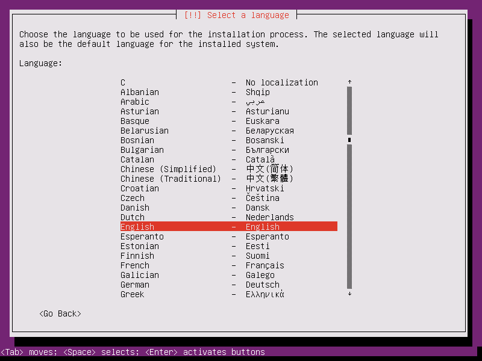
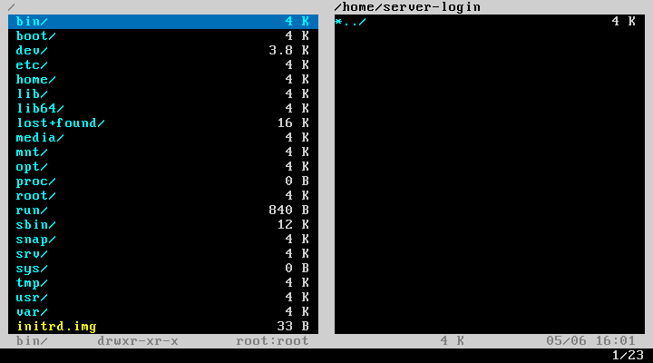
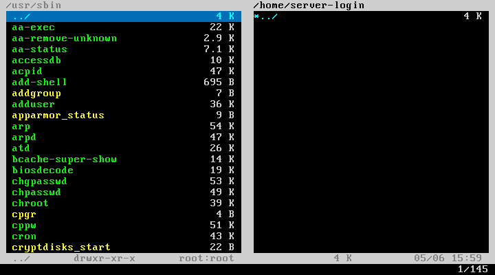

# Tutorial 15. Loops

## What you're going to learn

In this guide you're going to learn about `for` clauses in Testo-lang.

## Introduction

Our guides are getting to the end, we've learned about all the main features available in Testo-lang, except for one, which we're going to focus on in this guide: loops.

Up until this moment we've been developing tests without loops - there weren't just any need in them. But, of course, sometimes you may encounter a task when you have to do several repeatable actions - and that's where loops come in handy.

Loops are also useful when you don't know beforehand how many action repeats you need to do to get the desired result.

For instance, let's consider the Ubuntu Server language selection, which we've seen so many times:



We've been clicking Enter all these times, assuming we'd needed the English language and it was selected by default. But what if we need to pick a different language? If we needed to pick the Russian language, we would need to press Down 29 times to select it. But what if we don't want to count the times we need to press Down to pick the language of our choice? We just want to call a `select_menu("Русский")` macro and not worry about the implementation. In this guide we're going to develop just such a macro.

## What to begin with?

The goal of this guide is to automate the interaction with [Vifm](https://www.tecmint.com/vifm-commandline-based-file-manager-for-linux/) using loops. We've picked this exact file manager bacause it's the most simple and suitable for loops introduction. With certain efforts you could automate the interaction with any file manager you like in the exact same fashion.

For starters, let's clean up the script file of the things we won't need in this guide. Keep only one virtual machine (server), the OS and guest additions installation. We're also going to add the Vifm file manager installation from the Ubuntu repository. In the `loops_demo` test we're going to demonstrate the loops in action. For now let's just run Vifm and exit.

```testo
test server_install_ubuntu {
	server install_ubuntu("${server_hostname}", "${server_login}")
}

test server_prepare: server_install_ubuntu {
	server {
		install_guest_additions("${server_hostname}", "${server_login}")
		exec bash "apt install -y vifm"
	}
}

test loops_demo: server_prepare {
	server {
		type "vifm /"; press Enter
		abort "stop here"
	}
}
```

After the tests run we'll see the Vifm interface:



Let's assume that we want to get into the `/usr/sbin` directory. To do that we need to press Down 19 times, then press Enter, then press Down 6 more times and press Enter once again. Let's write this down:

```testo
test loops_demo: server_prepare {
	server {
		type "vifm /"; press Enter
		sleep 2s

		press Down*19, Enter
		press Down*6, Enter
		abort "stop here"
	}
}
```

This script does get us to the desired result:



But it looks really messy, doesn't it? We have two huge problems here:
1. This script is nearly unreadable - it's impossible to understand where we wanted to get after pressing Down 19 times and then 6 times more.
2. Counting everytime manually the times you need to press Down or Up is just indescribably boring and tedious.

Well, we can solve the problem #1 with a JS-selector (just like in the [previous tutorial](../14%20-%20js)). Indeed, we can make a check that we're selecting the row we really want to select. To do that, we just need to formalize the statement "The row is selected". In Vifm the selected row differs from the rest with the blue background. So let's recall the previous tutorial and improve our small test:

```testo
macro vifm_select(menu_entry) {
	if (check js "return find_text('${menu_entry}').match_background('blue').size() == 1") {
		press Enter
	} else {
		abort "Menu entry ${menu_entry} is not selected"
	}
}

test loops_demo: server_prepare {
	server {
		type "vifm /"; press Enter
		sleep 2s

		press Down*19; vifm_select("usr")
		press Down*6;  vifm_select("sbin")
		abort "stop here"
	}
}
```

Now the test is readable enough: at least we can say which row is selected each time. But the second problem remains: we still have to manually count the times to press Down in order to select the desired row. This problem may be solved with a loop.

## Selecting the desired row with a loop

Let's improve the `vifm_select` macro so it would pick the desired row (menu entry) automatically. Which means, that the macro must select the menu entry even though we don't know how many times we need to press Down - the macro should figure it out on its own.

We're going to implement the following algorithm:
1. Move the "Cursor" (selected row) to the uppermost position. In Vigm you can do it with the `gg` combination.
2. Now the loop begins. In each iteration we're going to check if the desired menu entry is selected already.
3. If the entry (row) is not selected yet, then we press Down one time and move on to the next iteration.
4. If the entry is selected, then we press Enter and exit the loop.
5. If we run out of attempts to select the desired row, we abort the test with an error.

The implementation looks like this:

```testo
macro vifm_select(menu_entry) {
	press g*2

	for (i IN RANGE 0 50) {
		if (check js "return find_text('${menu_entry}').match_background('blue').size() == 1") {
			print "Got to entry ${menu_entry} in ${i} steps"
			press Enter
			break
		}
		press Down
		sleep 50ms
	} else {
		abort "Menu entry ${menu_entry} doesn't exist!"
	}
}
```

Let's take a closer look at the `for` clause syntax. We can see the `i IN RANGE 0 50` expression placed in the header. This expression means that we want the loop to have 50 loops (the `0` is included and the `50` is excluded). `i` is a counter. You can access uts value inside the loop body (just like any other param or macro argument). We've used this feature to [print](../../reference/Actions.md#print) the exact number of steps it takes to get to the desired menu entry.

We took 50 as some kind of theoretical **guaranteed** maximum number of steps to get to the menu entry. But if the current directory is really large, 50 iterations may not be enough - so you should be smart when choosing the upper boundary for the RANGE. Too small boundary leads to the false negatives and too big leads to the very long waiting before the error shows up.

We also placed a short `sleep` after the press Down action. This is done to give the interface a little time to react to our action.

Take a look at the `else` part of the loop. Just like in some other languages, in Testo-lang loops may have the `else` part, which is triggered when all the **planned** loops have worked without any `break` statements. In our case, this `else` would mean that the desired menu entry hasn't been found at all.

> If the lower RANGE boundary equals to zero, it may be omitted like this: `i IN RANGE 50`.

> You could also specify the boundaries using the strings. Inside the strings param referencing is available. See [here](../../reference/Loops.md) for more information.

> You can't create infinite loops in Testo-lang, because we believe that each and every test must end at some point.

Now let's move back to the test itself:

```testo
test loops_demo: server_prepare {
	server {
		type "vifm /"; press Enter
		sleep 2s
		vifm_select("usr")
		vifm_select("sbin")
		abort "stop here"
	}
}
```

We can see it's gotten much shorter and neater. Now in order to navigate inside Vifm, all you need to do is to call the `vifm_select` macro and pass the argument with the row you want to select. You don't need to worry about counting the pressing Up/Down times.

Run the script and you'll see this output:

<Asset id="terminal1"/>

And that's how the loops could make your life a little easier in certain circumstances.

## Conclusions

Loops in Testo-lang are great in cases when you need to make several repeatable actions and when you don't know beforehand how many times exactly you need them to be applied. The most important part in loops is the correct "break" condition.
