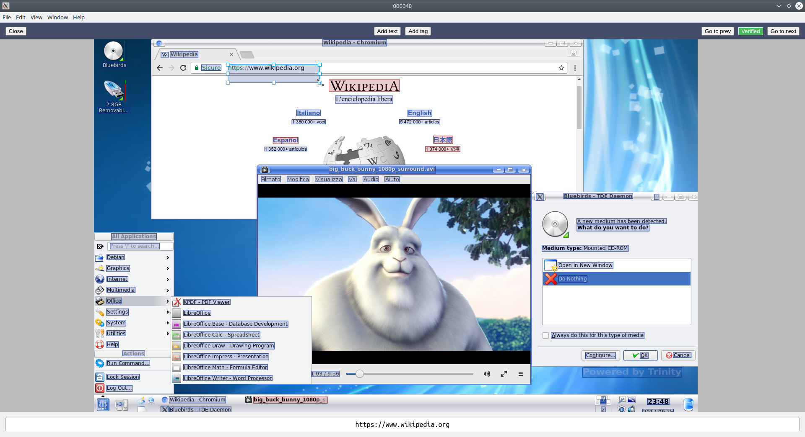

# Dataset editor

This is a simple tool for manual dataset labeling based on Electron and React. First of all you need to install packages:

```
npm i
```

After that you can run the editor:

```
npm run dev ../train
or
npm run dev ../validate
```

## Screenshot


